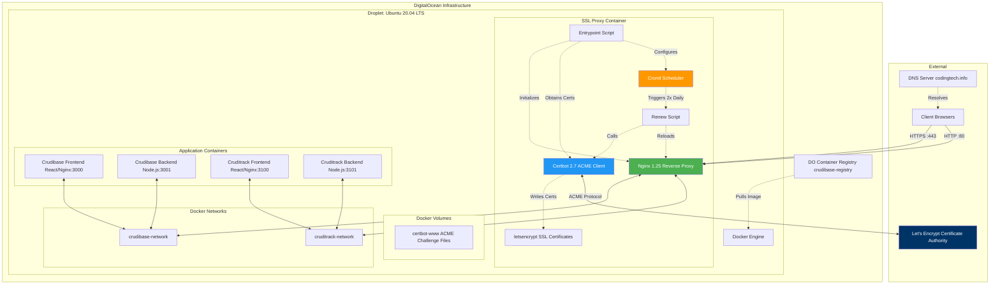
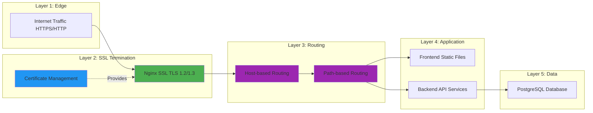
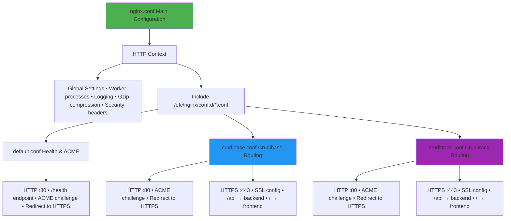
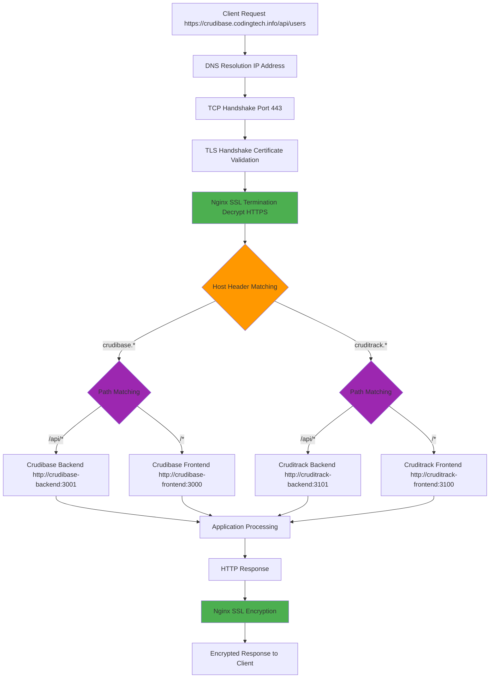
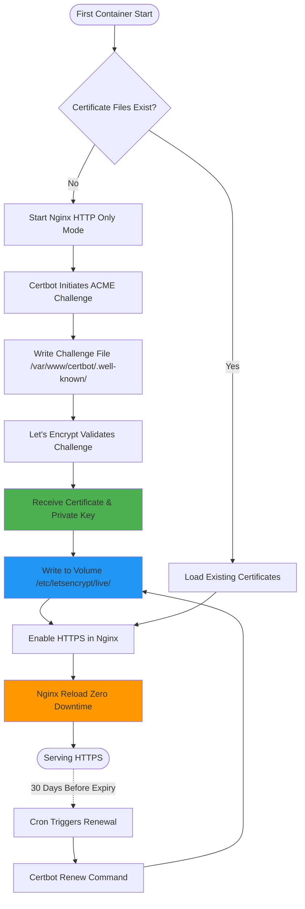
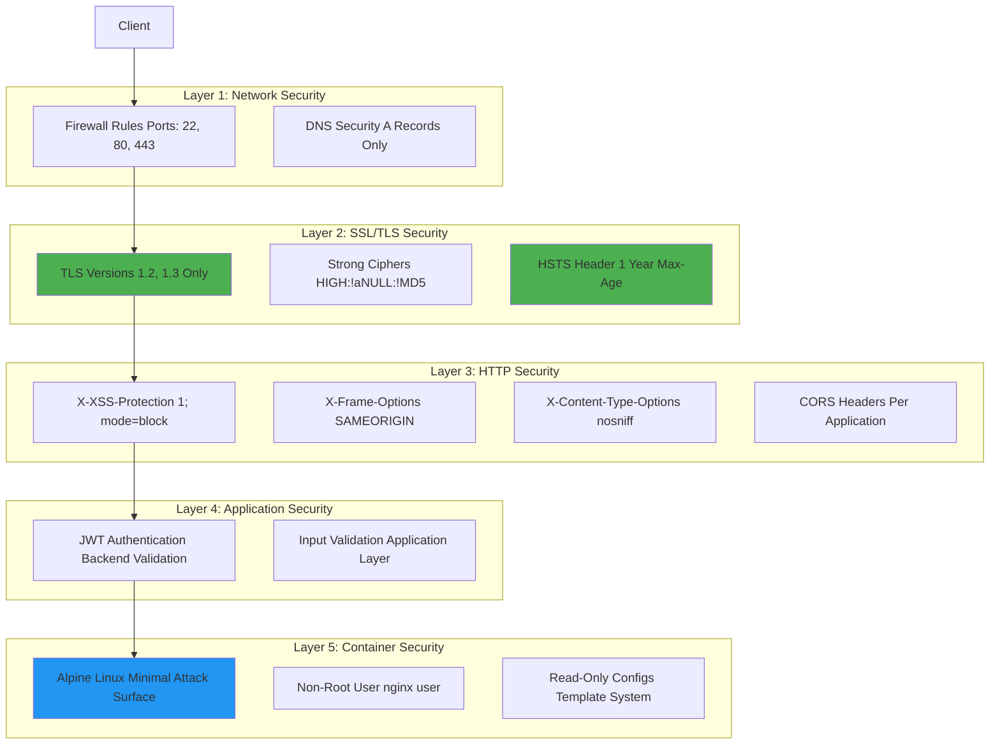
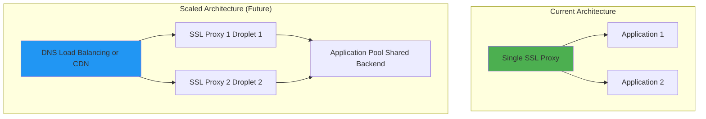

# Architecture Overview

This document provides a comprehensive overview of the SSL Proxy architecture, including system components, design patterns, and architectural decisions.

## Table of Contents

- [System Architecture](#system-architecture)
- [Component Architecture](#component-architecture)
- [Container Architecture](#container-architecture)
- [Data Flow Architecture](#data-flow-architecture)
- [Security Architecture](#security-architecture)
- [Design Patterns](#design-patterns)
- [Architectural Decisions](#architectural-decisions)

## System Architecture

### High-Level Architecture



### Architecture Layers



## Component Architecture

### SSL Proxy Container Internals

```mermaid
graph TB
    subgraph "Container Startup Sequence"
        Start([Container Start])
        Start --> Entrypoint[Entrypoint Script /entrypoint.sh]

        Entrypoint --> ProcessTemplates[Process Nginx Templates envsubst]
        ProcessTemplates --> TestNginx[Test Nginx Config nginx -t]
        TestNginx --> StartNginx1[Start Nginx Background Mode]

        StartNginx1 --> CheckCerts{Certificates Exist?}

        CheckCerts -->|No| ObtainCerts[Obtain Certificates certbot certonly]
        CheckCerts -->|Yes| SkipObtain[Skip Certificate Acquisition]

        ObtainCerts --> ReloadNginx[Reload Nginx nginx -s reload]
        SkipObtain --> ReloadNginx

        ReloadNginx --> SetupCron[Setup Cron Job Twice Daily Renewal]
        SetupCron --> StopNginx[Stop Background Nginx]
        StopNginx --> ExecNginx[Start Nginx Foreground Mode]
        ExecNginx --> Running([Container Running])
    end

    style Entrypoint fill:#FF9800
    style ObtainCerts fill:#2196F3
    style ExecNginx fill:#4CAF50
```



### Nginx Configuration Hierarchy



## Container Architecture

### Dockerfile Build Stages

```mermaid
graph LR
    Base[FROM nginx:1.25-alpine Base Image]

    Base --> Install[Install Packages • certbot • certbot-nginx • openssl • bash • curl • tzdata]

    Install --> Dirs[Create Directories • /etc/letsencrypt • /var/www/certbot • /var/log/letsencrypt]

    Dirs --> CopyNginx[Copy Nginx Configs • nginx.conf • templates/*.template]

    CopyNginx --> CopyScripts[Copy Scripts • entrypoint.sh • renew-certificates.sh]

    CopyScripts --> Perms[Set Permissions chmod +x scripts]

    Perms --> Expose[Expose Ports 80, 443]

    Expose --> Health[Configure Healthcheck curl /health]

    Health --> Entry[Set Entrypoint /entrypoint.sh]

    Entry --> CMD[Set CMD nginx -g 'daemon off;']

    CMD --> Final([Final Image ~48MB])

    style Base fill:#90CAF9
    style Final fill:#4CAF50
```



### Runtime Process Tree

```
ssl-proxy container (PID 1)
│
├── /entrypoint.sh (PID 1)
│   └── exec nginx -g 'daemon off;' (replaces PID 1)
│
├── nginx: master process (PID 1 after exec)
│   ├── nginx: worker process (PID 7)
│   ├── nginx: worker process (PID 8)
│   ├── nginx: worker process (PID 9)
│   └── nginx: worker process (PID 10)
│
└── crond (PID 15)
    └── (spawns renew-certificates.sh at 00:00 and 12:00)
```

## Data Flow Architecture

### Request Processing Pipeline



### Certificate Data Flow



## Security Architecture

### Security Layers



### Certificate Security Model

```mermaid
graph LR
    subgraph "Private Key Security"
        PK[Private Key RSA 2048+]
        PK_PERM[File Permissions 600 (owner only)]
        PK_VOL[Docker Volume Persistent Storage]

        PK --> PK_PERM
        PK_PERM --> PK_VOL
    end

    subgraph "Certificate Chain"
        CERT[Server Certificate]
        INTER[Intermediate CA]
        ROOT[Root CA Let's Encrypt]

        CERT --> INTER
        INTER --> ROOT
    end

    subgraph "Validation"
        OCSP[OCSP Stapling]
        VALID[Certificate Validity 90 Days]
        RENEW[Auto-Renewal at 60 Days]

        VALID --> RENEW
    end

    PK -.Signs.-> CERT
    CERT --> OCSP

    style PK fill:#F44336,color:#fff
    style CERT fill:#4CAF50,color:#fff
```

## Design Patterns

### 1. Template Pattern
Nginx configuration templates use environment variable substitution:
- **Templates**: `/etc/nginx/templates/*.template`
- **Processing**: `envsubst` command in entrypoint
- **Output**: `/etc/nginx/conf.d/*.conf`

**Benefits**:
- Single image for multiple environments
- Configuration via environment variables
- No rebuild needed for config changes

### 2. Sidecar Pattern
Certbot runs as a companion process to Nginx:
- **Primary**: Nginx (reverse proxy)
- **Sidecar**: Certbot (certificate management)
- **Coordination**: Shared volume for certificates

**Benefits**:
- Separation of concerns
- Independent updates possible
- Simplified container design

### 3. Volume Pattern
Persistent storage for certificates:
- **Volume**: `letsencrypt`
- **Mount**: `/etc/letsencrypt`
- **Lifecycle**: Survives container restarts

**Benefits**:
- Certificates persist across deployments
- No re-issuance on container restart
- Volume backups possible

### 4. Health Check Pattern
HTTP endpoint for container health:
- **Endpoint**: `GET /health`
- **Response**: `200 OK "healthy"`
- **Frequency**: Every 30 seconds

**Benefits**:
- Docker orchestration integration
- Early failure detection
- Load balancer integration ready

### 5. Zero-Downtime Reload Pattern
Graceful configuration reloads:
- **Command**: `nginx -s reload`
- **Process**: Master process spawns new workers
- **Old Workers**: Finish existing requests before exit

**Benefits**:
- No dropped connections
- Certificate updates without downtime
- Configuration changes without restart

## Architectural Decisions

### ADR-001: Nginx + Certbot over Traefik

**Decision**: Use Nginx with Certbot instead of Traefik for SSL proxy.

**Context**:
- Need SSL termination for multiple applications
- Automatic certificate management required
- Familiarity with Nginx vs. Traefik

**Rationale**:
- ✅ Nginx is well-understood and battle-tested
- ✅ Certbot is the official Let's Encrypt client
- ✅ Simpler configuration for basic use case
- ✅ Lower resource usage (Alpine base)
- ✅ Extensive documentation available

**Consequences**:
- Manual template creation for new apps
- Less dynamic than Traefik
- More configuration files to manage

### ADR-002: Single Container vs. Separate Containers

**Decision**: Run Nginx and Certbot in a single container.

**Context**:
- Certbot needs to write files that Nginx reads
- Certificate renewal requires Nginx reload
- Tight coupling between components

**Rationale**:
- ✅ Simplified deployment (single docker-compose service)
- ✅ Shared file system (no volume sharing complexity)
- ✅ Coordinated lifecycle
- ✅ Easier to manage cron for renewal

**Consequences**:
- Violates "one process per container" guideline
- Can't scale Nginx independently
- Both components update together

### ADR-003: Template-Based Configuration

**Decision**: Use `envsubst` templates instead of dynamic configuration.

**Context**:
- Need to support multiple applications
- Configuration should be environment-specific
- Must avoid rebuilding image for config changes

**Rationale**:
- ✅ Environment variables provide flexibility
- ✅ Single image works across environments
- ✅ Standard Unix tool (envsubst)
- ✅ Easy to validate generated configs

**Consequences**:
- Templates must be updated for new features
- All variables must be defined
- Requires container restart for config changes

### ADR-004: AMD64 Only Build

**Decision**: Build for AMD64/x86_64 platform only.

**Context**:
- DigitalOcean droplets use AMD64 architecture
- Multi-arch builds take significantly longer
- No ARM deployment planned

**Rationale**:
- ✅ Faster build times (2-3 minutes vs. 5-10 minutes)
- ✅ Smaller registry storage
- ✅ Matches deployment target exactly
- ✅ Simpler build process

**Consequences**:
- Won't run on ARM-based systems
- Not compatible with M1/M2 Macs natively (use emulation)
- Would need rebuild for ARM deployment

### ADR-005: Twice-Daily Certificate Renewal

**Decision**: Run certificate renewal check twice daily (00:00 and 12:00).

**Context**:
- Certbot renews certificates 30 days before expiry
- Let's Encrypt certificates valid for 90 days
- Need balance between freshness and API usage

**Rationale**:
- ✅ Provides redundancy (if one run fails, next is 12 hours away)
- ✅ Aligns with Certbot best practices
- ✅ Low API usage (only checks, doesn't renew unless needed)
- ✅ Ensures certificates always fresh

**Consequences**:
- Slightly more API calls than once-daily
- Small CPU usage twice per day
- Logs may have many "not due for renewal" entries

## Scalability Considerations

### Current Design Limitations

1. **Single Instance**: One SSL proxy per droplet
2. **No Load Balancing**: Single point of entry
3. **Vertical Scaling Only**: Add more resources to droplet

### Future Scaling Options



## Related Documentation

- **[Components](Components)** - Detailed component documentation
- **[Network Architecture](Network-Architecture)** - Docker networking details
- **[SSL Certificate Management](SSL-Certificate-Management)** - Certificate lifecycle
- **[Deployment Workflow](Deployment-Workflow)** - Build and deployment process

---

**Last Updated**: 2025-11-18
