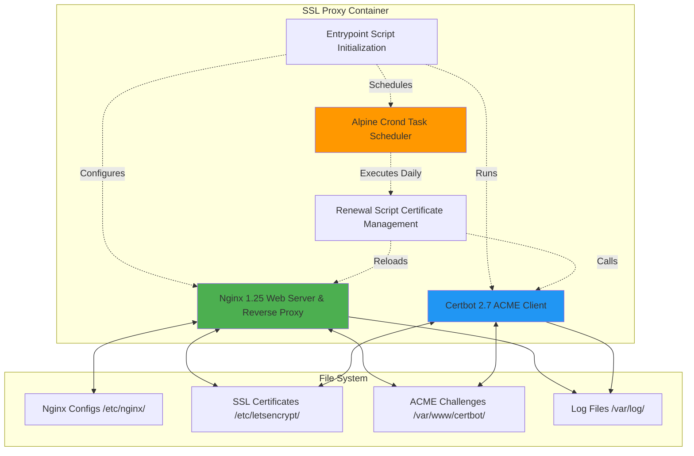

# Components Documentation

This document provides detailed documentation of all components that make up the SSL Proxy system.

## Table of Contents

- [Core Components](#core-components)
- [Nginx](#nginx)
- [Certbot](#certbot)
- [Cron](#cron)
- [Scripts](#scripts)
- [Docker Components](#docker-components)
- [Configuration Files](#configuration-files)

## Core Components

### Component Overview



### Component Stack

| Layer | Component | Version | Purpose |
|-------|-----------|---------|---------|
| **Base OS** | Alpine Linux | 3.18+ | Minimal, secure foundation |
| **Web Server** | Nginx | 1.25 | Reverse proxy & SSL termination |
| **SSL Management** | Certbot | 2.7+ | Certificate acquisition & renewal |
| **Scheduler** | crond | Alpine default | Periodic certificate renewal |
| **Shell** | Bash | 5.x | Script execution |
| **Utilities** | curl, openssl | Latest | Health checks, SSL operations |

## Nginx

### Overview

Nginx serves as the core reverse proxy and SSL termination layer.

**Purpose**:
- Terminate HTTPS connections (decrypt TLS)
- Route requests based on host and path
- Add security and proxy headers
- Serve ACME challenge files
- Redirect HTTP to HTTPS

### Configuration Structure

```
/etc/nginx/
├── nginx.conf                 # Main configuration
├── conf.d/                    # Active configurations (generated from templates)
│   ├── default.conf           # Health check & ACME (from template)
│   ├── crudibase.conf         # Crudibase routing (from template)
│   └── cruditrack.conf        # Cruditrack routing (from template)
├── templates/                 # Configuration templates
│   ├── default.conf.template
│   ├── crudibase.conf.template
│   └── cruditrack.conf.template
└── mime.types                 # MIME type mappings
```

### Main Configuration (`nginx.conf`)

**Location**: `/etc/nginx/nginx.conf`

**Key Sections**:

#### 1. Global Settings

```nginx
user nginx;
worker_processes auto;  # One worker per CPU core
error_log /var/log/nginx/error.log warn;
pid /var/run/nginx.pid;
```

#### 2. Events Block

```nginx
events {
    worker_connections 1024;  # Max connections per worker
}
```

**Capacity**: `worker_processes * worker_connections = total connections`
- Example: 4 cores × 1024 = 4096 concurrent connections

#### 3. HTTP Block

```nginx
http {
    # MIME types
    include /etc/nginx/mime.types;
    default_type application/octet-stream;

    # Logging
    log_format main '$remote_addr - $remote_user [$time_local] "$request" '
                    '$status $body_bytes_sent "$http_referer" '
                    '"$http_user_agent" "$http_x_forwarded_for"';
    access_log /var/log/nginx/access.log main;

    # Performance
    sendfile on;            # Efficient file serving
    tcp_nopush on;          # Send headers in one packet
    tcp_nodelay on;         # Don't buffer small packets
    keepalive_timeout 65;   # Keep connections open for reuse
    client_max_body_size 20M;  # Max upload size

    # Compression
    gzip on;
    gzip_vary on;
    gzip_proxied any;
    gzip_comp_level 6;
    gzip_types text/plain text/css text/xml text/javascript
               application/json application/javascript ...;

    # Security headers
    add_header X-Frame-Options "SAMEORIGIN" always;
    add_header X-Content-Type-Options "nosniff" always;
    add_header X-XSS-Protection "1; mode=block" always;

    # Include site configurations
    include /etc/nginx/conf.d/*.conf;
}
```

### Template Processing

Templates use environment variable substitution via `envsubst`:

**Template Example** (`crudibase.conf.template`):
```nginx
server {
    listen 443 ssl http2;
    server_name crudibase.${DOMAIN};  # Variable substituted

    location /api/ {
        proxy_pass http://${CRUDIBASE_BACKEND_HOST}:${CRUDIBASE_BACKEND_PORT}/;
        # Variables: CRUDIBASE_BACKEND_HOST, CRUDIBASE_BACKEND_PORT
    }
}
```

**Processing** (in `entrypoint.sh`):
```bash
for template in /etc/nginx/templates/*.template; do
    filename=$(basename "$template" .template)
    output="/etc/nginx/conf.d/$filename"
    envsubst '${DOMAIN} ${CRUDIBASE_BACKEND_HOST} ...' < "$template" > "$output"
done
```

**Generated Config** (`crudibase.conf`):
```nginx
server {
    listen 443 ssl http2;
    server_name crudibase.codingtech.info;  # Substituted

    location /api/ {
        proxy_pass http://crudibase-backend:3001/;  # Substituted
    }
}
```

### Nginx Server Blocks

#### 1. Default Server (Health & ACME)

**File**: `default.conf.template`

```nginx
server {
    listen 80;
    server_name _;  # Catch-all

    # Health check (for Docker healthcheck)
    location /health {
        access_log off;
        return 200 "healthy\n";
        add_header Content-Type text/plain;
    }

    # ACME challenge (for Let's Encrypt)
    location /.well-known/acme-challenge/ {
        root /var/www/certbot;
    }

    # Default redirect
    location / {
        return 301 https://$host$request_uri;
    }
}
```

#### 2. Application Server (HTTPS)

**File**: `crudibase.conf.template`

**HTTP Block** (Port 80):
```nginx
server {
    listen 80;
    server_name crudibase.${DOMAIN};

    # ACME challenge
    location /.well-known/acme-challenge/ {
        root /var/www/certbot;
    }

    # Redirect to HTTPS
    location / {
        return 301 https://$host$request_uri;
    }
}
```

**HTTPS Block** (Port 443):
```nginx
server {
    listen 443 ssl http2;
    server_name crudibase.${DOMAIN};

    # SSL certificates
    ssl_certificate /etc/letsencrypt/live/crudibase.${DOMAIN}/fullchain.pem;
    ssl_certificate_key /etc/letsencrypt/live/crudibase.${DOMAIN}/privkey.pem;

    # SSL settings
    ssl_protocols TLSv1.2 TLSv1.3;
    ssl_ciphers HIGH:!aNULL:!MD5;
    ssl_prefer_server_ciphers on;
    ssl_session_cache shared:SSL:10m;
    ssl_session_timeout 10m;

    # Security headers
    add_header Strict-Transport-Security "max-age=31536000; includeSubDomains" always;

    # Proxy headers (for both locations)
    proxy_set_header Host $host;
    proxy_set_header X-Real-IP $remote_addr;
    proxy_set_header X-Forwarded-For $proxy_add_x_forwarded_for;
    proxy_set_header X-Forwarded-Proto $scheme;

    # Backend API
    location /api/ {
        proxy_pass http://${CRUDIBASE_BACKEND_HOST}:${CRUDIBASE_BACKEND_PORT}/;
        proxy_http_version 1.1;

        # WebSocket support
        proxy_set_header Upgrade $http_upgrade;
        proxy_set_header Connection 'upgrade';
        proxy_cache_bypass $http_upgrade;

        # CORS headers
        add_header Access-Control-Allow-Origin "https://crudibase.${DOMAIN}" always;
        add_header Access-Control-Allow-Methods "GET, POST, PUT, DELETE, OPTIONS" always;
        add_header Access-Control-Allow-Headers "Authorization, Content-Type" always;
        add_header Access-Control-Allow-Credentials "true" always;

        if ($request_method = 'OPTIONS') {
            return 204;
        }
    }

    # Frontend
    location / {
        proxy_pass http://${CRUDIBASE_FRONTEND_HOST}:${CRUDIBASE_FRONTEND_PORT};
        proxy_http_version 1.1;

        # WebSocket support
        proxy_set_header Upgrade $http_upgrade;
        proxy_set_header Connection 'upgrade';
        proxy_cache_bypass $http_upgrade;
    }
}
```

### Nginx Commands

```bash
# Test configuration
nginx -t

# Reload configuration (graceful)
nginx -s reload

# Stop nginx
nginx -s stop

# Quit nginx (graceful)
nginx -s quit

# View compiled configuration
nginx -T

# Check version
nginx -v
```

## Certbot

### Overview

Certbot is the official Let's Encrypt client for obtaining and managing SSL/TLS certificates.

**Purpose**:
- Obtain SSL certificates from Let's Encrypt
- Validate domain ownership (HTTP-01 challenge)
- Renew certificates before expiry
- Store certificates securely

### Installation

Installed via Alpine package manager in Dockerfile:

```dockerfile
RUN apk add --no-cache \
    certbot \
    certbot-nginx \
    openssl
```

### Directory Structure

```
/etc/letsencrypt/
├── live/                          # Symlinks to current certificates
│   └── crudibase.codingtech.info/
│       ├── fullchain.pem → ../../archive/.../fullchain1.pem
│       ├── privkey.pem → ../../archive/.../privkey1.pem
│       ├── cert.pem → ../../archive/.../cert1.pem
│       └── chain.pem → ../../archive/.../chain1.pem
├── archive/                       # Certificate history
│   └── crudibase.codingtech.info/
│       ├── fullchain1.pem         # Version 1
│       ├── fullchain2.pem         # Version 2 (after renewal)
│       ├── privkey1.pem
│       └── ...
├── renewal/                       # Renewal configurations
│   └── crudibase.codingtech.info.conf
└── accounts/                      # Account credentials
    └── acme-v02.api.letsencrypt.org/
        └── directory/
            └── {account-id}/
```

### Certbot Commands

#### Certificate Acquisition

```bash
# Obtain certificate (used in entrypoint.sh)
certbot certonly \
    --webroot \
    --webroot-path=/var/www/certbot \
    --email admin@example.com \
    --agree-tos \
    --no-eff-email \
    -d crudibase.codingtech.info
```

**Parameters**:
- `certonly`: Only obtain cert, don't install
- `--webroot`: Use webroot plugin (HTTP-01 challenge)
- `--webroot-path`: Where to write challenge files
- `--email`: Contact email for urgent notices
- `--agree-tos`: Agree to Terms of Service
- `--no-eff-email`: Don't share email with EFF
- `-d`: Domain name

#### Certificate Renewal

```bash
# Check and renew certificates (used in renew-certificates.sh)
certbot renew \
    --quiet \
    --webroot \
    --webroot-path=/var/www/certbot

# Dry run (test without actually renewing)
certbot renew --dry-run

# Force renewal (even if not due)
certbot renew --force-renewal
```

#### Certificate Management

```bash
# List all certificates
certbot certificates

# Output example:
# Found the following certs:
#   Certificate Name: crudibase.codingtech.info
#     Domains: crudibase.codingtech.info
#     Expiry Date: 2025-02-15 12:34:56+00:00 (VALID: 89 days)
#     Certificate Path: /etc/letsencrypt/live/crudibase.../fullchain.pem
#     Private Key Path: /etc/letsencrypt/live/crudibase.../privkey.pem

# Revoke certificate
certbot revoke --cert-path /etc/letsencrypt/live/crudibase.../cert.pem

# Delete certificate
certbot delete --cert-name crudibase.codingtech.info
```

### Certbot Configuration Files

#### Renewal Config (`renewal/crudibase.codingtech.info.conf`)

```ini
# renew_before_expiry = 30 days
version = 2.7.4
archive_dir = /etc/letsencrypt/archive/crudibase.codingtech.info
cert = /etc/letsencrypt/live/crudibase.codingtech.info/cert.pem
privkey = /etc/letsencrypt/live/crudibase.codingtech.info/privkey.pem
chain = /etc/letsencrypt/live/crudibase.codingtech.info/chain.pem
fullchain = /etc/letsencrypt/live/crudibase.codingtech.info/fullchain.pem

# Options used in the renewal process
[renewalparams]
account = abc123...
authenticator = webroot
webroot_path = /var/www/certbot,
server = https://acme-v02.api.letsencrypt.org/directory
```

## Cron

### Overview

Alpine's crond manages scheduled tasks, specifically certificate renewal.

**Purpose**:
- Run certificate renewal check twice daily
- Execute `renew-certificates.sh` script
- Log renewal attempts

### Cron Configuration

**Setup** (in `entrypoint.sh`):
```bash
# Setup certificate renewal cron job
echo "0 0,12 * * * /usr/local/bin/renew-certificates.sh >> /var/log/letsencrypt/renew.log 2>&1" > /etc/crontabs/root
crond
```

**Schedule Breakdown**:
```
0 0,12 * * *
│ │    │ │ │
│ │    │ │ └─ Day of week (0-6, 0=Sunday)
│ │    │ └─── Month (1-12)
│ │    └───── Day of month (1-31)
│ └────────── Hour (0-23)
└──────────── Minute (0-59)
```

**Translation**: Run at minute 0 of hours 0 and 12, every day
- **00:00** (midnight)
- **12:00** (noon)

### Cron Management

```bash
# View crontab
crontab -l

# Edit crontab (inside container)
crontab -e

# Check if crond is running
ps aux | grep crond

# View cron logs (in renew.log)
cat /var/log/letsencrypt/renew.log

# Manual execution
/usr/local/bin/renew-certificates.sh
```

## Scripts

### Entrypoint Script

**Location**: `/entrypoint.sh`
**Purpose**: Container initialization and configuration

**Flow**:
1. Load environment variables
2. Process Nginx templates
3. Test Nginx configuration
4. Start Nginx (background)
5. Check for existing certificates
6. Obtain certificates if needed
7. Reload Nginx with SSL
8. Setup cron for renewal
9. Start Nginx (foreground)

**Key Functions**:

```bash
# Function to obtain certificate
obtain_certificate() {
    local subdomain=$1
    local full_domain="${subdomain}.${DOMAIN}"

    echo "Checking certificate for $full_domain..."

    # Check if certificate exists
    if [ -f "/etc/letsencrypt/live/${full_domain}/fullchain.pem" ]; then
        echo "  Certificate already exists"
        return 0
    fi

    # Build certbot arguments
    local certbot_args="certonly --webroot ..."

    # Add staging flag if enabled
    if [ "$STAGING" = "true" ]; then
        certbot_args="$certbot_args --staging"
    fi

    # Obtain certificate
    if certbot $certbot_args -d $full_domain; then
        echo "  Successfully obtained certificate"
        return 0
    else
        echo "  Failed to obtain certificate"
        return 1
    fi
}
```

### Renewal Script

**Location**: `/usr/local/bin/renew-certificates.sh`
**Purpose**: Automated certificate renewal (called by cron)

**Script**:
```bash
#!/bin/bash
set -e

echo "[$(date)] Starting certificate renewal check..."

# Attempt to renew certificates
if certbot renew --quiet --webroot --webroot-path=/var/www/certbot; then
    echo "[$(date)] Certificate renewal check completed successfully"

    # Reload nginx if any certificates were renewed
    if nginx -t 2>/dev/null; then
        nginx -s reload
        echo "[$(date)] Nginx reloaded"
    fi
else
    echo "[$(date)] Certificate renewal check failed"
    exit 1
fi

echo "[$(date)] Certificate renewal process finished"
```

**Behavior**:
- Runs twice daily
- Checks all certificates
- Renews if < 30 days until expiry
- Reloads Nginx if renewals occurred
- Logs all actions

### Build Script

**Location**: `scripts/build-and-push.sh` (on Mac)
**Purpose**: Build and push Docker image to registry

See [Deployment Workflow](Deployment-Workflow) for details.

### Test Build Script

**Location**: `scripts/test-build.sh`
**Purpose**: Local testing without pushing to registry

```bash
#!/bin/bash
set -e

echo "Building test image locally..."

docker build \
    --tag ssl-proxy:test \
    --platform linux/amd64 \
    .

echo "✅ Test build complete"
echo "Run with: docker run --rm ssl-proxy:test nginx -t"
```

## Docker Components

### Dockerfile

**Multi-stage build**: No (single stage)
**Base image**: `nginx:1.25-alpine`
**Target platform**: `linux/amd64`

**Build stages**:
1. Base image selection
2. Package installation
3. Directory creation
4. File copying
5. Permission setting
6. Port exposure
7. Healthcheck configuration
8. Entrypoint and CMD

### Docker Volumes

#### 1. letsencrypt

**Purpose**: Persist SSL certificates across container restarts

```yaml
volumes:
  letsencrypt:
    driver: local

services:
  ssl-proxy:
    volumes:
      - letsencrypt:/etc/letsencrypt
```

**Contents**:
- Certificate files
- Private keys
- Renewal configurations
- Account credentials

#### 2. certbot-www

**Purpose**: Serve ACME challenge files

```yaml
volumes:
  certbot-www:
    driver: local

services:
  ssl-proxy:
    volumes:
      - certbot-www:/var/www/certbot
```

**Contents**:
- `.well-known/acme-challenge/` directory
- Challenge tokens (temporary files)

### Docker Networks

Connects to external networks created by application containers:

```yaml
networks:
  crudibase-network:
    external: true
  cruditrack-network:
    external: true
```

See [Network Architecture](Network-Architecture) for details.

### Healthcheck

**Configuration**:
```dockerfile
HEALTHCHECK --interval=30s --timeout=3s --start-period=5s --retries=3 \
    CMD curl -f http://localhost/health || exit 1
```

**Parameters**:
- `interval`: Check every 30 seconds
- `timeout`: Fail if check takes > 3 seconds
- `start-period`: Wait 5 seconds before first check
- `retries`: Mark unhealthy after 3 failures

**Health states**:
- `starting`: Initial state (during start-period)
- `healthy`: Healthcheck passing
- `unhealthy`: 3+ consecutive failures

## Configuration Files

### Environment Variables

See [Configuration Guide](Configuration) for complete reference.

### File Ownership and Permissions

```
/etc/nginx/
├── nginx.conf (root:root, 644)
├── conf.d/ (root:root, 755)
│   └── *.conf (root:root, 644)
└── templates/ (root:root, 755)
    └── *.template (root:root, 644)

/etc/letsencrypt/
├── live/ (root:root, 755)
│   └── */ (root:root, 755)
│       └── *.pem (root:root, 644)
├── archive/ (root:root, 700)
│   └── */ (root:root, 700)
│       └── *.pem (root:root, 600)  # Private keys

/usr/local/bin/
└── renew-certificates.sh (root:root, 755)

/entrypoint.sh (root:root, 755)
```

## Related Documentation

- **[Architecture](Architecture)** - System architecture overview
- **[SSL Certificate Management](SSL-Certificate-Management)** - Certificate lifecycle
- **[Network Architecture](Network-Architecture)** - Docker networking
- **[Configuration](Configuration)** - Environment variables and settings
- **[Deployment Workflow](Deployment-Workflow)** - Build and deployment

---

**Last Updated**: 2025-11-18
