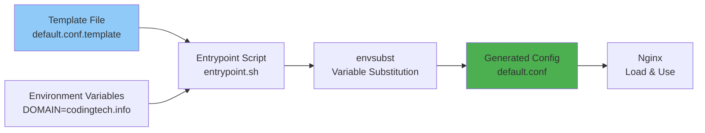

# Configuration Guide

This document provides comprehensive configuration reference for the SSL Proxy, including environment variables, templates, and customization options.

## Table of Contents

- [Environment Variables](#environment-variables)
- [Template System](#template-system)
- [Adding New Applications](#adding-new-applications)
- [SSL Configuration](#ssl-configuration)
- [Performance Tuning](#performance-tuning)
- [Security Configuration](#security-configuration)

## Environment Variables

All configuration is done via environment variables in `docker-compose.yml` or `docker-compose.prod.yml`.

### Required Variables

| Variable | Description | Example | Default |
|----------|-------------|---------|---------|
| `DOMAIN` | Base domain name | `codingtech.info` | `codingtech.info` |
| `EMAIL` | Contact email for Let's Encrypt | `admin@example.com` | `admin@${DOMAIN}` |

### Optional Global Variables

| Variable | Description | Example | Default |
|----------|-------------|---------|---------|
| `STAGING` | Use Let's Encrypt staging environment | `true` or `false` | `false` |

### Application Control Variables

| Variable | Description | Example | Default |
|----------|-------------|---------|---------|
| `ENABLE_CRUDIBASE` | Enable Crudibase proxy | `true` or `false` | `true` |
| `ENABLE_CRUDITRACK` | Enable Cruditrack proxy | `true` or `false` | `true` |

### Crudibase Variables

| Variable | Description | Example | Default |
|----------|-------------|---------|---------|
| `CRUDIBASE_BACKEND_HOST` | Backend container hostname | `crudibase-backend` | `crudibase-backend` |
| `CRUDIBASE_BACKEND_PORT` | Backend container port | `3001` | `3001` |
| `CRUDIBASE_FRONTEND_HOST` | Frontend container hostname | `crudibase-frontend` | `crudibase-frontend` |
| `CRUDIBASE_FRONTEND_PORT` | Frontend container port | `3000` | `3000` |

### Cruditrack Variables

| Variable | Description | Example | Default |
|----------|-------------|---------|---------|
| `CRUDITRACK_BACKEND_HOST` | Backend container hostname | `cruditrack-backend` | `cruditrack-backend` |
| `CRUDITRACK_BACKEND_PORT` | Backend container port | `3101` | `3101` |
| `CRUDITRACK_FRONTEND_HOST` | Frontend container hostname | `cruditrack-frontend` | `cruditrack-frontend` |
| `CRUDITRACK_FRONTEND_PORT` | Frontend container port | `3100` | `3100` |

### Complete Configuration Example

```yaml
# docker-compose.prod.yml
version: '3.8'

services:
  ssl-proxy:
    image: registry.digitalocean.com/crudibase-registry/ssl-proxy:latest
    container_name: ssl-proxy
    restart: unless-stopped
    ports:
      - "80:80"
      - "443:443"
    environment:
      # Required
      - DOMAIN=codingtech.info
      - EMAIL=admin@codingtech.info

      # Optional
      - STAGING=false

      # Crudibase
      - ENABLE_CRUDIBASE=true
      - CRUDIBASE_BACKEND_HOST=crudibase-backend
      - CRUDIBASE_BACKEND_PORT=3001
      - CRUDIBASE_FRONTEND_HOST=crudibase-frontend
      - CRUDIBASE_FRONTEND_PORT=3000

      # Cruditrack
      - ENABLE_CRUDITRACK=true
      - CRUDITRACK_BACKEND_HOST=cruditrack-backend
      - CRUDITRACK_BACKEND_PORT=3101
      - CRUDITRACK_FRONTEND_HOST=cruditrack-frontend
      - CRUDITRACK_FRONTEND_PORT=3100
    volumes:
      - letsencrypt:/etc/letsencrypt
      - certbot-www:/var/www/certbot
      - ./logs:/var/log/nginx
    networks:
      - crudibase-network
      - cruditrack-network

volumes:
  letsencrypt:
  certbot-www:

networks:
  crudibase-network:
    external: true
  cruditrack-network:
    external: true
```

## Template System

### How Templates Work

The SSL Proxy uses `envsubst` to process Nginx configuration templates during container startup.

**Process**:
1. Templates stored in `/etc/nginx/templates/*.template`
2. Entrypoint script processes each template
3. Variables substituted with environment values
4. Output written to `/etc/nginx/conf.d/*.conf`
5. Nginx loads the generated configurations

### Template Processing Flow



### Template Example

**Before** (`crudibase.conf.template`):
```nginx
server {
    listen 443 ssl http2;
    server_name crudibase.${DOMAIN};

    ssl_certificate /etc/letsencrypt/live/crudibase.${DOMAIN}/fullchain.pem;
    ssl_certificate_key /etc/letsencrypt/live/crudibase.${DOMAIN}/privkey.pem;

    location /api/ {
        proxy_pass http://${CRUDIBASE_BACKEND_HOST}:${CRUDIBASE_BACKEND_PORT}/;
    }

    location / {
        proxy_pass http://${CRUDIBASE_FRONTEND_HOST}:${CRUDIBASE_FRONTEND_PORT};
    }
}
```

**After** (with `DOMAIN=codingtech.info`, etc.):
```nginx
server {
    listen 443 ssl http2;
    server_name crudibase.codingtech.info;

    ssl_certificate /etc/letsencrypt/live/crudibase.codingtech.info/fullchain.pem;
    ssl_certificate_key /etc/letsencrypt/live/crudibase.codingtech.info/privkey.pem;

    location /api/ {
        proxy_pass http://crudibase-backend:3001/;
    }

    location / {
        proxy_pass http://crudibase-frontend:3000;
    }
}
```

### Variables Used in Templates

Entrypoint script specifies which variables to substitute:

```bash
# In entrypoint.sh
envsubst '${DOMAIN} ${CRUDIBASE_BACKEND_HOST} ${CRUDIBASE_BACKEND_PORT} ${CRUDIBASE_FRONTEND_HOST} ${CRUDIBASE_FRONTEND_PORT} ${CRUDITRACK_BACKEND_HOST} ${CRUDITRACK_BACKEND_PORT} ${CRUDITRACK_FRONTEND_HOST} ${CRUDITRACK_FRONTEND_PORT}' < "$template" > "$output"
```

## Adding New Applications

To add a new application (e.g., `myapp.codingtech.info`):

### Step 1: Create Nginx Template

Create `/nginx/templates/myapp.conf.template`:

```nginx
# MyApp HTTP - Redirect to HTTPS
server {
    listen 80;
    server_name myapp.${DOMAIN};

    # ACME challenge
    location /.well-known/acme-challenge/ {
        root /var/www/certbot;
    }

    # Redirect to HTTPS
    location / {
        return 301 https://$host$request_uri;
    }
}

# MyApp HTTPS
server {
    listen 443 ssl http2;
    server_name myapp.${DOMAIN};

    # SSL certificates
    ssl_certificate /etc/letsencrypt/live/myapp.${DOMAIN}/fullchain.pem;
    ssl_certificate_key /etc/letsencrypt/live/myapp.${DOMAIN}/privkey.pem;

    # SSL configuration
    ssl_protocols TLSv1.2 TLSv1.3;
    ssl_ciphers HIGH:!aNULL:!MD5;
    ssl_prefer_server_ciphers on;

    # Security headers
    add_header Strict-Transport-Security "max-age=31536000; includeSubDomains" always;

    # Proxy headers
    proxy_set_header Host $host;
    proxy_set_header X-Real-IP $remote_addr;
    proxy_set_header X-Forwarded-For $proxy_add_x_forwarded_for;
    proxy_set_header X-Forwarded-Proto $scheme;

    # Backend API
    location /api/ {
        proxy_pass http://${MYAPP_BACKEND_HOST}:${MYAPP_BACKEND_PORT}/;
        proxy_http_version 1.1;
        proxy_set_header Upgrade $http_upgrade;
        proxy_set_header Connection 'upgrade';

        # CORS headers
        add_header Access-Control-Allow-Origin "https://myapp.${DOMAIN}" always;
        add_header Access-Control-Allow-Methods "GET, POST, PUT, DELETE, OPTIONS" always;
        add_header Access-Control-Allow-Headers "Authorization, Content-Type" always;

        if ($request_method = 'OPTIONS') {
            return 204;
        }
    }

    # Frontend
    location / {
        proxy_pass http://${MYAPP_FRONTEND_HOST}:${MYAPP_FRONTEND_PORT};
        proxy_http_version 1.1;
        proxy_set_header Upgrade $http_upgrade;
        proxy_set_header Connection 'upgrade';
    }
}
```

### Step 2: Update Entrypoint Script

Edit `/scripts/entrypoint.sh` to add certificate acquisition:

```bash
# Add after existing certificate acquisition blocks
if [ "${ENABLE_MYAPP:-false}" = "true" ]; then
    echo "Obtaining certificate for myapp..."
    if ! obtain_certificate "myapp"; then
        CERT_FAILED=true
        echo "WARNING: Failed to obtain certificate for myapp"
        rm -f /etc/nginx/conf.d/myapp.conf
    fi
fi
```

Also update the `envsubst` command to include new variables:

```bash
envsubst '${DOMAIN} ... ${MYAPP_BACKEND_HOST} ${MYAPP_BACKEND_PORT} ${MYAPP_FRONTEND_HOST} ${MYAPP_FRONTEND_PORT}' < "$template" > "$output"
```

### Step 3: Update docker-compose.yml

Add environment variables:

```yaml
environment:
  # ... existing variables ...

  # MyApp
  - ENABLE_MYAPP=true
  - MYAPP_BACKEND_HOST=myapp-backend
  - MYAPP_BACKEND_PORT=3201
  - MYAPP_FRONTEND_HOST=myapp-frontend
  - MYAPP_FRONTEND_PORT=3200

networks:
  # ... existing networks ...
  - myapp-network

networks:
  # ... existing networks ...
  myapp-network:
    external: true
```

### Step 4: Configure DNS

Add DNS A record:

| Hostname | Type | Value | TTL |
|----------|------|-------|-----|
| `myapp` | A | YOUR_DROPLET_IP | 3600 |

### Step 5: Rebuild and Deploy

```bash
# On Mac - Rebuild image
./scripts/build-and-push.sh

# On Droplet - Deploy updated image
cd /opt/ssl-proxy
docker compose -f docker-compose.prod.yml pull
docker compose -f docker-compose.prod.yml up -d
```

## SSL Configuration

### Supported TLS Versions

```nginx
ssl_protocols TLSv1.2 TLSv1.3;
```

**Why these versions?**
- ✅ TLS 1.2: Wide compatibility, secure
- ✅ TLS 1.3: Latest version, best performance
- ❌ TLS 1.0/1.1: Deprecated, insecure

### Cipher Configuration

```nginx
ssl_ciphers HIGH:!aNULL:!MD5;
ssl_prefer_server_ciphers on;
```

**Explanation**:
- `HIGH`: Use high-security ciphers
- `!aNULL`: Exclude anonymous ciphers (no authentication)
- `!MD5`: Exclude MD5-based ciphers (weak)
- `ssl_prefer_server_ciphers on`: Server chooses cipher (more secure)

### Session Configuration

```nginx
ssl_session_cache shared:SSL:10m;
ssl_session_timeout 10m;
```

**Benefits**:
- Faster reconnections (session resumption)
- Reduced CPU usage (avoid repeated handshakes)
- `shared:SSL:10m`: 10MB cache shared across workers (~40,000 sessions)
- `10m` timeout: Sessions valid for 10 minutes

### Custom SSL Settings

To customize SSL settings, edit `nginx/templates/*.conf.template`:

**Example - Stricter cipher suite**:
```nginx
ssl_ciphers 'ECDHE-ECDSA-AES128-GCM-SHA256:ECDHE-RSA-AES128-GCM-SHA256:ECDHE-ECDSA-AES256-GCM-SHA384:ECDHE-RSA-AES256-GCM-SHA384';
```

**Example - Enable OCSP stapling**:
```nginx
ssl_stapling on;
ssl_stapling_verify on;
ssl_trusted_certificate /etc/letsencrypt/live/crudibase.${DOMAIN}/chain.pem;
```

## Performance Tuning

### Worker Processes

```nginx
# In nginx.conf
worker_processes auto;  # One worker per CPU core
```

**Recommendation**:
- `auto`: Nginx detects CPU cores automatically
- Manual: Set to number of CPU cores (e.g., `worker_processes 2;`)

### Worker Connections

```nginx
# In nginx.conf
events {
    worker_connections 1024;
}
```

**Total capacity**: `worker_processes × worker_connections`
- Example: 4 workers × 1024 = 4096 concurrent connections

**For high traffic sites**, increase to:
```nginx
worker_connections 4096;  # 16,384 total with 4 workers
```

### Keepalive Connections

```nginx
# In nginx.conf
keepalive_timeout 65;
```

**Benefits**:
- Reuse connections instead of creating new ones
- Reduces latency and CPU usage

### Gzip Compression

```nginx
# In nginx.conf
gzip on;
gzip_vary on;
gzip_proxied any;
gzip_comp_level 6;
gzip_types text/plain text/css text/xml text/javascript
           application/json application/javascript application/xml+rss;
```

**Compression Levels**:
- `1`: Fastest, least compression
- `6`: Balanced (recommended)
- `9`: Slowest, maximum compression

### Client Body Size

```nginx
# In nginx.conf
client_max_body_size 20M;
```

**Purpose**: Maximum upload size (file uploads, API payloads)

**Adjust based on needs**:
- Small APIs: `10M`
- File uploads: `50M` or `100M`
- Large files: `500M` or more

### Buffer Sizes

**Optional optimization** (add to `nginx.conf`):
```nginx
http {
    # Buffer sizes
    client_body_buffer_size 128k;
    client_header_buffer_size 1k;
    large_client_header_buffers 4 16k;
    output_buffers 1 32k;
    postpone_output 1460;
}
```

## Security Configuration

### Security Headers

Configured globally in `nginx.conf`:

```nginx
# Global security headers
add_header X-Frame-Options "SAMEORIGIN" always;
add_header X-Content-Type-Options "nosniff" always;
add_header X-XSS-Protection "1; mode=block" always;
```

HSTS configured per-site in templates:

```nginx
# In crudibase.conf.template (HTTPS block only)
add_header Strict-Transport-Security "max-age=31536000; includeSubDomains" always;
```

### Header Reference

| Header | Value | Purpose |
|--------|-------|---------|
| `X-Frame-Options` | `SAMEORIGIN` | Prevent clickjacking (only allow same-origin framing) |
| `X-Content-Type-Options` | `nosniff` | Prevent MIME-type sniffing |
| `X-XSS-Protection` | `1; mode=block` | Enable XSS filter in old browsers |
| `Strict-Transport-Security` | `max-age=31536000; includeSubDomains` | Force HTTPS for 1 year, including subdomains |

### Stricter HSTS (Optional)

**Include subdomains and preload**:
```nginx
add_header Strict-Transport-Security "max-age=31536000; includeSubDomains; preload" always;
```

**Warning**: Only use `preload` if you're sure you want to be added to browsers' HSTS preload list (hard to undo).

### Content Security Policy (Optional)

**Add to HTTPS server blocks**:
```nginx
add_header Content-Security-Policy "default-src 'self'; script-src 'self' 'unsafe-inline'; style-src 'self' 'unsafe-inline';" always;
```

### Rate Limiting (Optional)

**Limit request rate per IP**:

```nginx
# In nginx.conf http block
http {
    # Define rate limit zone
    limit_req_zone $binary_remote_addr zone=api_limit:10m rate=10r/s;

    # ... rest of config
}
```

**Apply to location**:
```nginx
# In crudibase.conf.template
location /api/ {
    limit_req zone=api_limit burst=20 nodelay;
    # ... proxy settings
}
```

**Parameters**:
- `rate=10r/s`: 10 requests per second per IP
- `burst=20`: Allow bursts up to 20 requests
- `nodelay`: Don't delay requests in burst

### IP Whitelisting (Optional)

**Restrict access to specific IPs**:

```nginx
# In location block
location /admin/ {
    allow 203.0.113.0/24;  # Allow this network
    allow 198.51.100.50;   # Allow specific IP
    deny all;              # Deny everyone else

    proxy_pass http://backend:3001/admin/;
}
```

## Configuration Validation

### Before Deployment

```bash
# On Mac - Test build locally
./scripts/test-build.sh

# Run test container
docker run --rm ssl-proxy:test nginx -t
# Output: nginx: configuration file /etc/nginx/nginx.conf test is successful
```

### After Deployment

```bash
# SSH to droplet
ssh root@YOUR_DROPLET_IP

# Test config in running container
docker exec ssl-proxy nginx -t

# View compiled config
docker exec ssl-proxy nginx -T | less

# Reload after config change
docker exec ssl-proxy nginx -s reload
```

## Environment-Specific Configuration

### Development (Local)

```yaml
environment:
  - STAGING=true  # Use Let's Encrypt staging
  - CRUDIBASE_BACKEND_HOST=host.docker.internal  # Access host machine
```

### Staging

```yaml
environment:
  - STAGING=true  # Test certificates without rate limits
  - DOMAIN=staging.codingtech.info
```

### Production

```yaml
environment:
  - STAGING=false  # Use real Let's Encrypt certificates
  - DOMAIN=codingtech.info
```

## Related Documentation

- **[Components](Components.md)** - Nginx component details
- **[SSL Certificate Management](SSL-Certificate-Management.md)** - Certificate configuration
- **[Deployment Workflow](Deployment-Workflow.md)** - Deploying configuration changes
- **[Troubleshooting](Troubleshooting.md)** - Configuration issues

---

**Last Updated**: 2025-11-18
