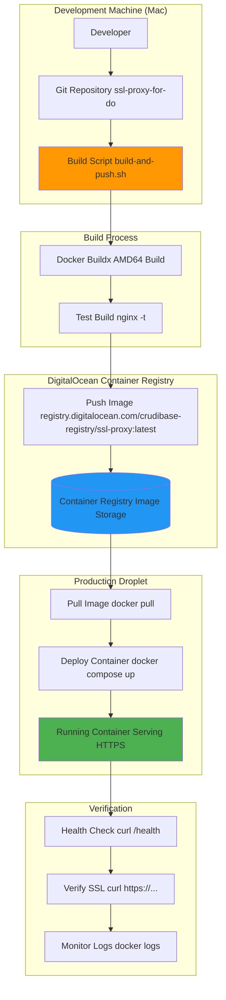
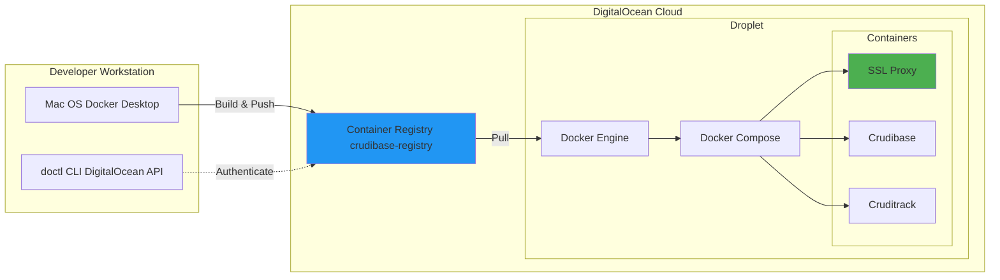
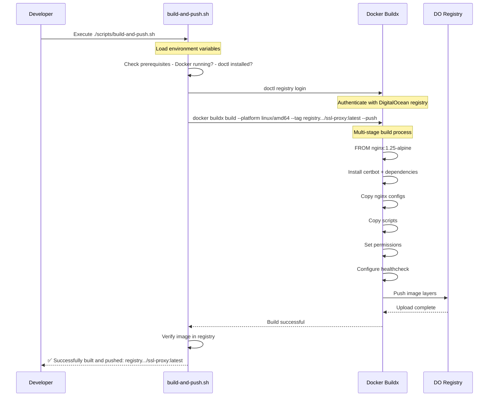
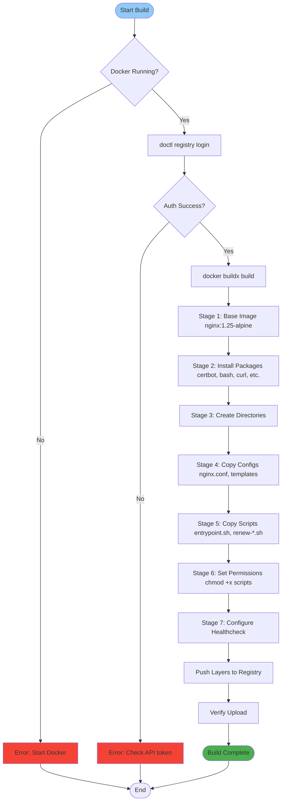
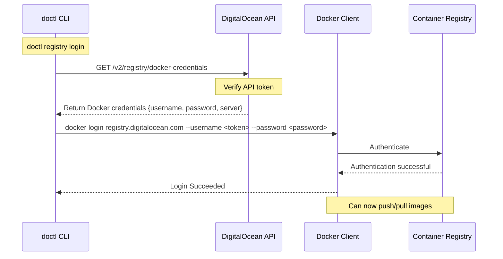
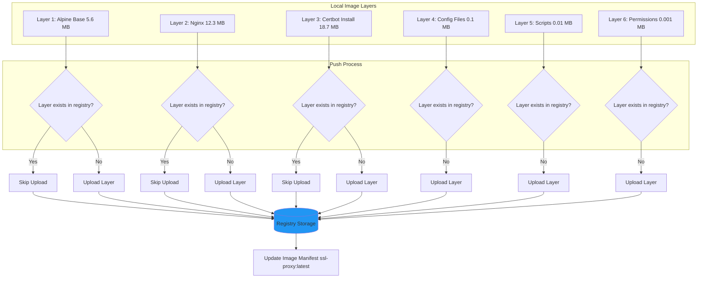
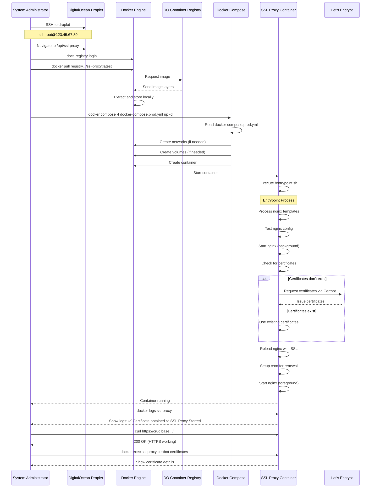
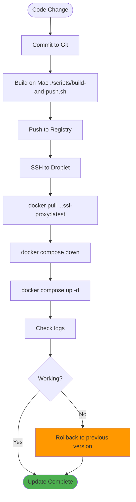
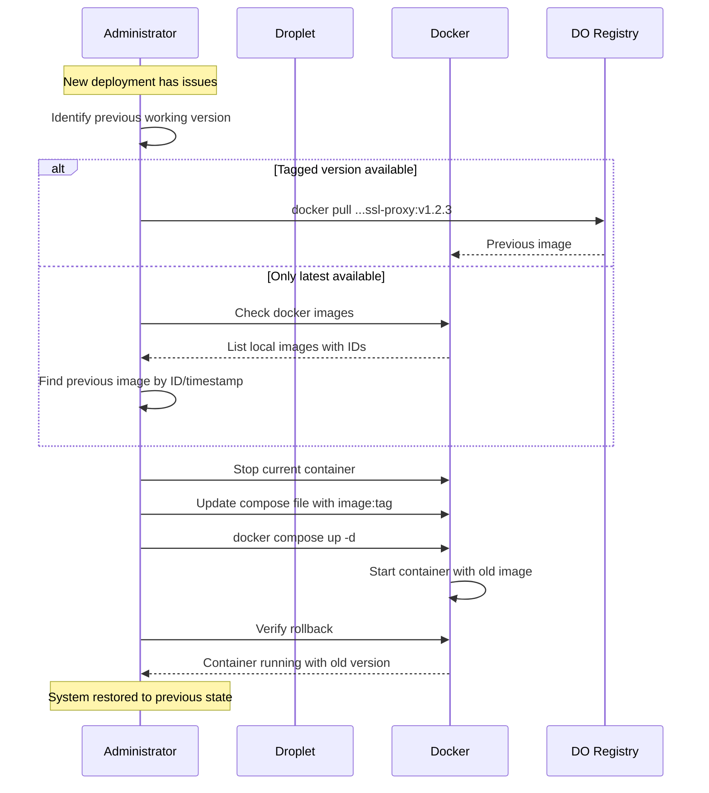

# Deployment Workflow

This document details the complete deployment workflow for the SSL Proxy, from building the Docker image on a development machine to running it in production on a DigitalOcean droplet.

## Table of Contents

- [Overview](#overview)
- [Deployment Architecture](#deployment-architecture)
- [Build Process](#build-process)
- [Push to Registry](#push-to-registry)
- [Deployment Process](#deployment-process)
- [Update Process](#update-process)
- [Rollback Process](#rollback-process)

## Overview

The deployment workflow follows a three-stage pipeline:

1. **Build** - Create AMD64 Docker image on development machine
2. **Push** - Upload image to DigitalOcean Container Registry
3. **Deploy** - Pull and run image on production droplet

### Deployment Flow Diagram



## Deployment Architecture

### Infrastructure Overview



## Build Process

### Build Script Execution Flow



### Build Script (`scripts/build-and-push.sh`)

```bash
#!/bin/bash
set -e

echo "=== Building and Pushing SSL Proxy to DigitalOcean Registry ==="

# Configuration
REGISTRY="registry.digitalocean.com/crudibase-registry"
IMAGE_NAME="ssl-proxy"
TAG="latest"
FULL_IMAGE="${REGISTRY}/${IMAGE_NAME}:${TAG}"

echo "Image: ${FULL_IMAGE}"
echo "Platform: linux/amd64"

# Check Docker is running
if ! docker info > /dev/null 2>&1; then
    echo "Error: Docker is not running"
    exit 1
fi

# Login to DigitalOcean Container Registry
echo "Logging in to DigitalOcean Container Registry..."
doctl registry login

# Build and push for AMD64 (DigitalOcean droplet architecture)
echo "Building and pushing image..."
docker buildx build \
    --platform linux/amd64 \
    --tag "${FULL_IMAGE}" \
    --push \
    .

echo "✅ Successfully built and pushed: ${FULL_IMAGE}"
echo ""
echo "Next steps:"
echo "  1. SSH to your droplet"
echo "  2. Pull the image: docker pull ${FULL_IMAGE}"
echo "  3. Deploy: docker compose -f docker-compose.prod.yml up -d"
```

### Build Process Stages



### Build Output Example

```
=== Building and Pushing SSL Proxy to DigitalOcean Registry ===
Image: registry.digitalocean.com/crudibase-registry/ssl-proxy:latest
Platform: linux/amd64

Logging in to DigitalOcean Container Registry...
Logging Docker in to registry.digitalocean.com

Building and pushing image...
[+] Building 45.3s (12/12) FINISHED
 => [internal] load build definition from Dockerfile                      0.1s
 => [internal] load .dockerignore                                         0.0s
 => [internal] load metadata for docker.io/library/nginx:1.25-alpine      1.2s
 => [1/7] FROM docker.io/library/nginx:1.25-alpine@sha256:abc123...       5.4s
 => [internal] load build context                                         0.1s
 => [2/7] RUN apk add --no-cache certbot certbot-nginx openssl bash...  28.3s
 => [3/7] RUN mkdir -p /etc/letsencrypt /var/www/certbot...              0.3s
 => [4/7] COPY nginx/templates /etc/nginx/templates                       0.1s
 => [5/7] COPY nginx/nginx.conf /etc/nginx/nginx.conf                     0.0s
 => [6/7] COPY scripts/renew-certificates.sh /usr/local/bin/              0.0s
 => [7/7] COPY scripts/entrypoint.sh /entrypoint.sh                       0.0s
 => exporting to image                                                    3.2s
 => => exporting layers                                                   3.1s
 => => writing image sha256:def456...                                     0.0s
 => => naming to registry.digitalocean.com/crudibase-registry/ssl-proxy   0.0s
 => pushing image to registry                                            6.7s

✅ Successfully built and pushed: registry.../ssl-proxy:latest

Next steps:
  1. SSH to your droplet
  2. Pull the image: docker pull registry.../ssl-proxy:latest
  3. Deploy: docker compose -f docker-compose.prod.yml up -d
```

## Push to Registry

### Registry Authentication Flow



### Image Layers and Pushing



## Deployment Process

### Complete Deployment Sequence



### Deployment Steps

#### Step 1: Prerequisites on Droplet

Ensure the following are ready before deployment:

```bash
# 1. Check Docker is installed and running
docker --version
# Docker version 24.0.7, build afdd53b

# 2. Check Docker Compose is available
docker compose version
# Docker Compose version v2.23.0

# 3. Verify applications are running
docker ps | grep crudibase
docker ps | grep cruditrack

# 4. Check networks exist
docker network ls | grep crudibase
docker network ls | grep cruditrack
```

#### Step 2: Create Production Directory

```bash
# Create directory structure
mkdir -p /opt/ssl-proxy
cd /opt/ssl-proxy

# Create production docker-compose file
cat > docker-compose.prod.yml << 'EOF'
version: '3.8'

services:
  ssl-proxy:
    image: registry.digitalocean.com/crudibase-registry/ssl-proxy:latest
    container_name: ssl-proxy
    restart: unless-stopped
    ports:
      - "80:80"
      - "443:443"
    environment:
      - DOMAIN=codingtech.info
      - EMAIL=admin@codingtech.info
      - STAGING=false
      - ENABLE_CRUDIBASE=true
      - CRUDIBASE_BACKEND_HOST=crudibase-backend
      - CRUDIBASE_BACKEND_PORT=3001
      - CRUDIBASE_FRONTEND_HOST=crudibase-frontend
      - CRUDIBASE_FRONTEND_PORT=3000
      - ENABLE_CRUDITRACK=true
      - CRUDITRACK_BACKEND_HOST=cruditrack-backend
      - CRUDITRACK_BACKEND_PORT=3101
      - CRUDITRACK_FRONTEND_HOST=cruditrack-frontend
      - CRUDITRACK_FRONTEND_PORT=3100
    volumes:
      - letsencrypt:/etc/letsencrypt
      - certbot-www:/var/www/certbot
      - ./logs:/var/log/nginx
    networks:
      - crudibase-network
      - cruditrack-network

volumes:
  letsencrypt:
  certbot-www:

networks:
  crudibase-network:
    external: true
  cruditrack-network:
    external: true
EOF
```

#### Step 3: Pull and Deploy

```bash
# Authenticate with registry
doctl registry login

# Pull latest image
docker pull registry.digitalocean.com/crudibase-registry/ssl-proxy:latest

# Start the service
docker compose -f docker-compose.prod.yml up -d

# Watch logs
docker compose -f docker-compose.prod.yml logs -f ssl-proxy
```

#### Step 4: Verification

```bash
# 1. Check container status
docker ps | grep ssl-proxy
# Should show: Up X minutes (healthy)

# 2. View logs for successful startup
docker logs ssl-proxy
# Should see:
# ✅ Successfully obtained certificate for crudibase.codingtech.info
# ✅ Successfully obtained certificate for cruditrack.codingtech.info
# ✅ SSL Proxy Started

# 3. Check certificates
docker exec ssl-proxy certbot certificates
# Should list both certificates with expiry dates

# 4. Test HTTPS endpoints
curl -I https://crudibase.codingtech.info
curl -I https://cruditrack.codingtech.info
# Should return: HTTP/2 200

# 5. Test HTTP redirect
curl -I http://crudibase.codingtech.info
# Should return: HTTP/1.1 301 Moved Permanently
# Location: https://crudibase.codingtech.info/

# 6. Check health endpoint
curl http://YOUR_DROPLET_IP/health
# Should return: healthy
```

## Update Process

### Update Workflow



### Update Commands

```bash
# On Mac - Build and push new version
cd /path/to/ssl-proxy-for-do
git pull  # Get latest code
./scripts/build-and-push.sh

# On Droplet - Deploy update
cd /opt/ssl-proxy
docker compose -f docker-compose.prod.yml pull
docker compose -f docker-compose.prod.yml up -d

# Verify update
docker compose -f docker-compose.prod.yml logs -f ssl-proxy
```

### Zero-Downtime Updates

For zero-downtime updates, use rolling update strategy:

```bash
# 1. Pull new image (doesn't affect running container)
docker pull registry.digitalocean.com/crudibase-registry/ssl-proxy:latest

# 2. Create new container with new image
docker compose -f docker-compose.prod.yml up -d --no-deps ssl-proxy

# Docker will:
# - Start new container with new image
# - Wait for new container to be healthy
# - Stop old container
# - Remove old container
```

## Rollback Process

### Rollback Scenario



### Rollback Commands

#### Option 1: Using Image ID (if image still local)

```bash
# 1. List local images with timestamps
docker images registry.digitalocean.com/crudibase-registry/ssl-proxy

# Output example:
# REPOSITORY                                            TAG       IMAGE ID       CREATED
# registry.../ssl-proxy   latest    abc123     2 hours ago
# registry.../ssl-proxy   <none>    def456     1 day ago

# 2. Stop current container
docker compose -f docker-compose.prod.yml down

# 3. Tag the old image
docker tag def456 registry.digitalocean.com/crudibase-registry/ssl-proxy:rollback

# 4. Update docker-compose.prod.yml to use :rollback tag
# Change: image: ...ssl-proxy:latest
# To:     image: ...ssl-proxy:rollback

# 5. Start with old image
docker compose -f docker-compose.prod.yml up -d
```

#### Option 2: Using Git Tags (recommended)

```bash
# On Mac - Checkout previous version
cd /path/to/ssl-proxy-for-do
git log --oneline
# abc123 Update nginx config (current - broken)
# def456 Fix SSL certificate renewal (previous - working)

git checkout def456

# Build and push with specific tag
docker buildx build \
    --platform linux/amd64 \
    --tag registry.../ssl-proxy:rollback-$(date +%Y%m%d) \
    --push \
    .

# On Droplet - Deploy previous version
docker pull registry.../ssl-proxy:rollback-20251118
docker compose -f docker-compose.prod.yml down
# Update image tag in docker-compose.prod.yml
docker compose -f docker-compose.prod.yml up -d
```

### Rollback Verification

```bash
# Check container is running
docker ps | grep ssl-proxy

# Verify certificate status
docker exec ssl-proxy certbot certificates

# Test HTTPS endpoints
curl -I https://crudibase.codingtech.info
curl -I https://cruditrack.codingtech.info

# Check logs for errors
docker logs ssl-proxy --tail 100
```

## Deployment Checklist

### Pre-Deployment

- [ ] Code changes committed to Git
- [ ] Local build successful (`./scripts/build-and-push.sh`)
- [ ] Image pushed to registry
- [ ] DNS records configured and propagated
- [ ] Application containers running on droplet
- [ ] Docker networks exist (`crudibase-network`, `cruditrack-network`)
- [ ] Firewall allows ports 80 and 443

### Deployment

- [ ] SSH to droplet
- [ ] Pull latest image
- [ ] Update `docker-compose.prod.yml` if needed
- [ ] Deploy container (`docker compose up -d`)
- [ ] Watch logs for successful startup
- [ ] Wait for certificate acquisition (first deploy only)

### Post-Deployment

- [ ] Container status: healthy
- [ ] Certificates obtained/loaded
- [ ] HTTPS endpoints respond with 200 OK
- [ ] HTTP redirects to HTTPS
- [ ] Security headers present in responses
- [ ] Health check endpoint responding
- [ ] No errors in logs

### Monitoring (First 24 Hours)

- [ ] Check logs periodically: `docker logs ssl-proxy`
- [ ] Monitor certificate renewal cron job
- [ ] Verify application functionality
- [ ] Check for any 502/504 errors
- [ ] Monitor SSL certificate expiry dates

## Related Documentation

- **[Architecture](Architecture)** - System architecture
- **[Components](Components)** - Docker and component details
- **[Configuration](Configuration)** - Environment variables and settings
- **[Troubleshooting](Troubleshooting)** - Debugging deployment issues

---

**Last Updated**: 2025-11-18
