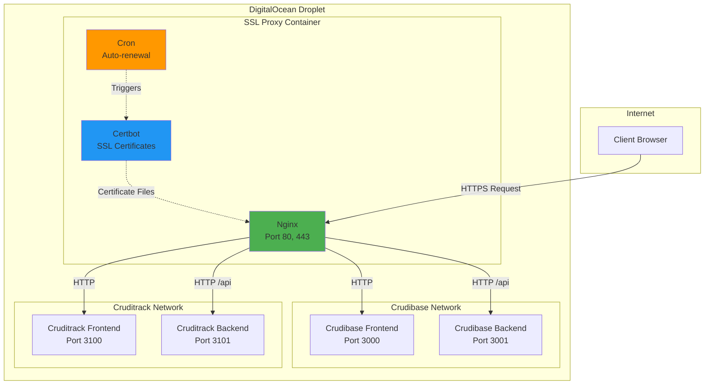

# SSL Proxy for DigitalOcean - Wiki

Welcome to the SSL Proxy for DigitalOcean documentation wiki. This project provides automated SSL certificate management and reverse proxy capabilities for multiple applications on DigitalOcean droplets.

## Overview

The SSL Proxy is a production-ready Docker image that combines **Nginx** and **Certbot** to provide:
- Automatic SSL/TLS certificate generation via Let's Encrypt
- HTTPS termination and reverse proxy for multiple applications
- Automatic certificate renewal (twice daily via cron)
- Zero-downtime certificate updates
- Security headers and CORS configuration
- Multi-application support with independent routing

**Production URLs:**
- Crudibase: `https://crudibase.codingtech.info`
- Cruditrack: `https://cruditrack.codingtech.info`

## Quick Links

### Architecture & Design
- **[Architecture Overview](Architecture)** - System architecture, components, and design patterns
- **[Network Architecture](Network-Architecture)** - Docker networking, container communication, and network topology
- **[Request Flow](Request-Flow)** - How HTTPS requests are processed from client to backend

### Components
- **[Core Components](Components)** - Detailed documentation of Nginx, Certbot, and supporting components
- **[SSL Certificate Management](SSL-Certificate-Management)** - Certificate acquisition, renewal, and lifecycle management

### Operations
- **[Deployment Workflow](Deployment-Workflow)** - Build, push, and deployment processes with diagrams
- **[Configuration Guide](Configuration)** - Environment variables, templates, and customization
- **[Troubleshooting](Troubleshooting)** - Common issues, solutions, and debugging techniques

## Key Features

### 🔒 SSL/TLS Management
- **Automatic Certificate Issuance**: Let's Encrypt certificates obtained on first run
- **Auto-Renewal**: Certificates renewed automatically 30 days before expiry
- **Staging Mode**: Test certificate issuance without rate limits
- **Zero-Downtime**: Nginx reloads gracefully when certificates update

### 🎯 Multi-Application Support
- Route multiple applications on the same droplet
- Independent SSL certificates per subdomain
- Configurable enable/disable per application
- Easy to add new applications via templates

### 🛡️ Security
- TLS 1.2 and TLS 1.3 support
- HSTS with 1-year max-age
- Security headers (XSS, Frame protection, Content-Type sniffing protection)
- CORS configuration per application
- HTTP to HTTPS automatic redirects

### 📦 Production Ready
- AMD64/x86_64 optimized for DigitalOcean droplets
- Alpine Linux base (minimal ~48MB image)
- Health check endpoint
- Comprehensive logging
- Gzip compression
- Docker volume persistence for certificates

## Architecture Diagram



## Project Structure

```
ssl-proxy-for-do/
├── Dockerfile                          # Alpine + Nginx + Certbot
├── docker-compose.yml                  # Local development compose
├── .env.example                        # Configuration template
│
├── nginx/
│   ├── nginx.conf                      # Main Nginx configuration
│   └── templates/
│       ├── default.conf.template       # Health check & ACME challenge
│       ├── crudibase.conf.template     # Crudibase routing
│       └── cruditrack.conf.template    # Cruditrack routing
│
├── scripts/
│   ├── entrypoint.sh                   # Container initialization
│   ├── renew-certificates.sh           # Certificate renewal (cron)
│   ├── build-and-push.sh              # Build & push to DO registry
│   └── test-build.sh                  # Local testing
│
├── docs/
│   ├── DO-SETUP-GUIDE.md              # DigitalOcean manual setup
│   ├── background.md                  # Project context
│   ├── DEPLOYMENT-WORKFLOW.md          # Deployment guide
│   ├── PROJECT-SUMMARY.md             # Project summary
│   └── QUICK-START.md                 # Quick start guide
│
└── wiki/                              # This wiki
    ├── Home.md
    ├── Architecture.md
    ├── Components.md
    ├── SSL-Certificate-Management.md
    ├── Request-Flow.md
    ├── Deployment-Workflow.md
    ├── Network-Architecture.md
    ├── Configuration.md
    └── Troubleshooting.md
```

## Quick Start

### Prerequisites
- DigitalOcean droplet with Docker installed
- Domain name pointing to droplet IP
- DNS A records configured for subdomains
- DigitalOcean Container Registry

### Build and Deploy

```bash
# On Mac - Build and push
cd /path/to/ssl-proxy-for-do
./scripts/build-and-push.sh

# On Droplet - Deploy
cd /opt/ssl-proxy
docker pull registry.digitalocean.com/crudibase-registry/ssl-proxy:latest
docker compose -f docker-compose.prod.yml up -d
```

For detailed deployment instructions, see **[Deployment Workflow](Deployment-Workflow)**.

## Technology Stack

| Component | Technology | Purpose |
|-----------|-----------|---------|
| **Base OS** | Alpine Linux 3.x | Minimal, secure base image |
| **Web Server** | Nginx 1.25 | Reverse proxy and SSL termination |
| **SSL/TLS** | Certbot 2.7+ | Let's Encrypt certificate management |
| **Scheduler** | crond | Automatic certificate renewal |
| **Container** | Docker | Application packaging and deployment |
| **Registry** | DigitalOcean Container Registry | Image storage and distribution |

## Certificate Lifecycle


## Related Documentation

- **Main README**: [README.md](../README)
- **Project Summary**: [PROJECT-SUMMARY.md](../PROJECT-SUMMARY)
- **Quick Start Guide**: [QUICK-START.md](../QUICK-START)
- **Deployment Workflow**: [DEPLOYMENT-WORKFLOW.md](../DEPLOYMENT-WORKFLOW)
- **DigitalOcean Setup**: [docs/DO-SETUP-GUIDE.md](../docs/DO-SETUP-GUIDE)

## Support

For issues and questions:
1. Check the **[Troubleshooting](Troubleshooting)** page
2. Review container logs: `docker compose logs ssl-proxy`
3. Test nginx config: `docker exec ssl-proxy nginx -t`
4. Check certificate status: `docker exec ssl-proxy certbot certificates`

## Contributing

To add a new application to the SSL proxy:
1. Create a new nginx template in `nginx/templates/myapp.conf.template`
2. Add environment variables to `docker-compose.yml`
3. Update `entrypoint.sh` to process the new config
4. Rebuild and push the image
5. Update DNS records in DigitalOcean

See **[Configuration Guide](Configuration)** for detailed instructions.

## License

MIT License - See main repository for details.

---

**Documentation Version**: 1.0
**Last Updated**: 2025-11-18
**Project Status**: ✅ Production Ready
