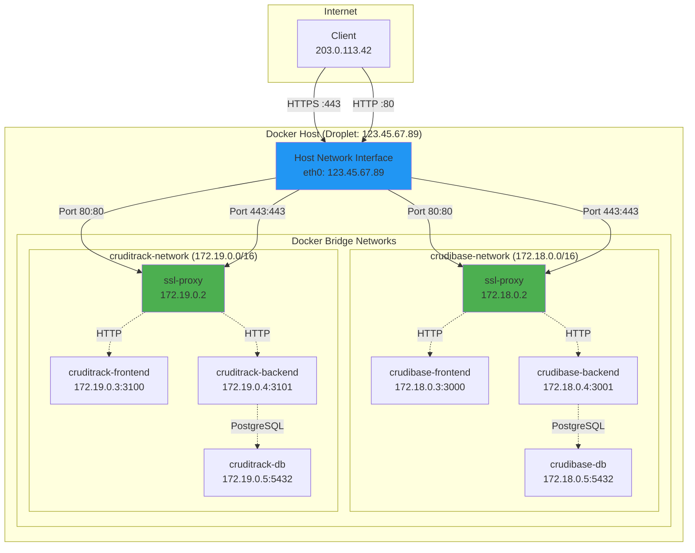
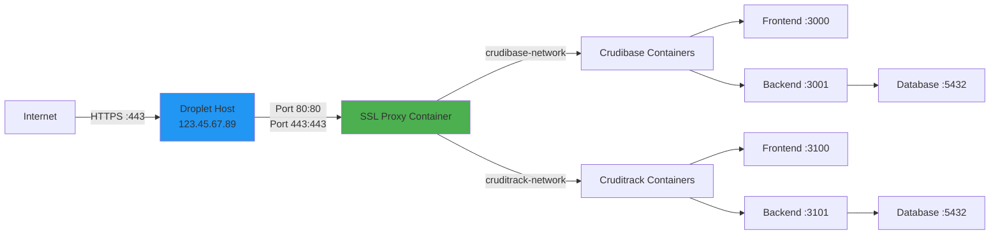
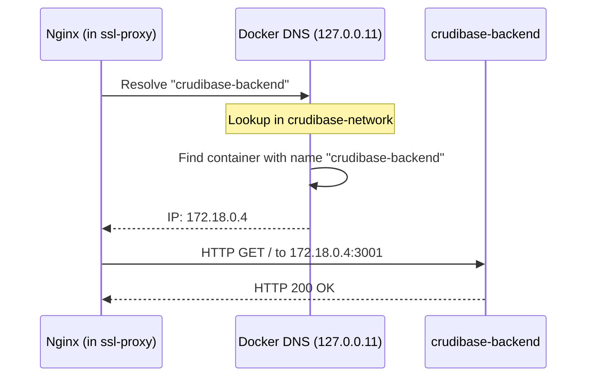
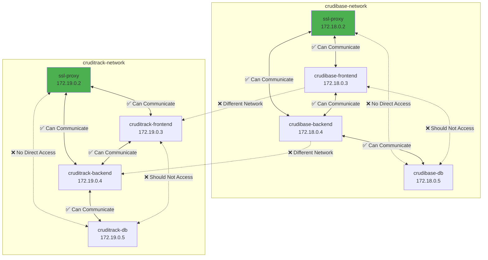
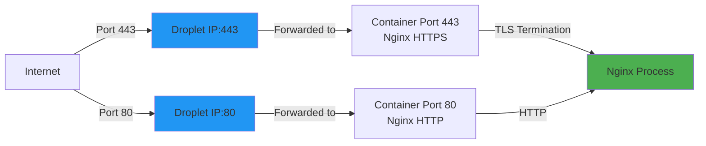
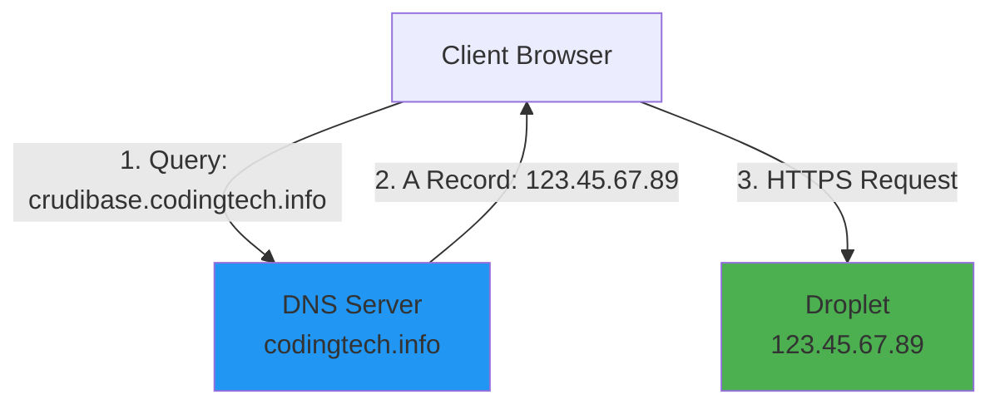
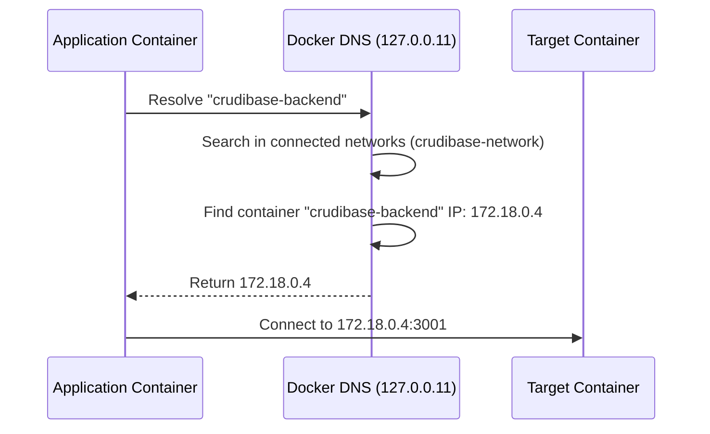
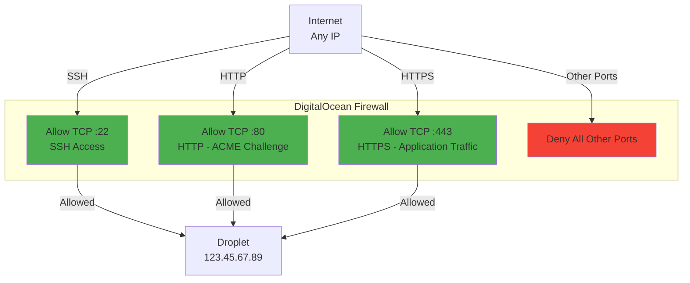
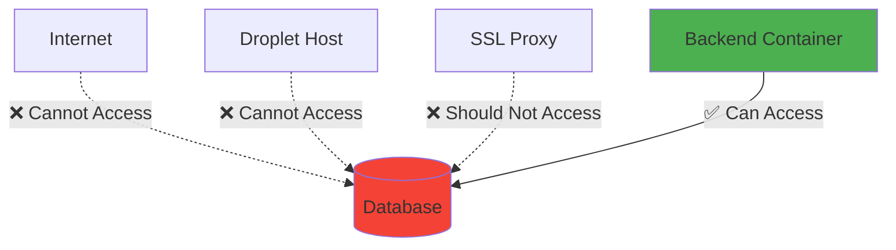

# Network Architecture

This document details the Docker networking architecture, container communication, and network topology of the SSL Proxy system.

## Table of Contents

- [Overview](#overview)
- [Network Topology](#network-topology)
- [Docker Networks](#docker-networks)
- [Container Communication](#container-communication)
- [Port Mapping](#port-mapping)
- [DNS Resolution](#dns-resolution)
- [Network Security](#network-security)

## Overview

The SSL Proxy uses Docker's bridge networking to connect to application containers while exposing ports 80 and 443 to the internet.

### Network Design Principles

1. **External Networks**: SSL Proxy connects to existing application networks
2. **Port Binding**: Ports 80/443 published to host
3. **Service Discovery**: Docker DNS resolves container names
4. **Network Isolation**: Applications isolated in separate networks
5. **Bridge Networks**: All networks use Docker bridge driver

## Network Topology

### Complete Network Diagram



### Simplified Communication Flow



## Docker Networks

### Network List

| Network Name | Driver | Scope | Subnet | Created By |
|--------------|--------|-------|--------|------------|
| `crudibase-network` | bridge | local | 172.18.0.0/16 | Crudibase docker-compose |
| `cruditrack-network` | bridge | local | 172.19.0.0/16 | Cruditrack docker-compose |

### Network Configuration

#### Crudibase Network

Created by Crudibase application's `docker-compose.yml`:

```yaml
# In /opt/crudibase/docker-compose.yml
networks:
  crudibase-network:
    driver: bridge
    ipam:
      config:
        - subnet: 172.18.0.0/16
```

**Connected Containers**:
- `crudibase-frontend` (172.18.0.3)
- `crudibase-backend` (172.18.0.4)
- `crudibase-db` (172.18.0.5)
- `ssl-proxy` (172.18.0.2)

#### Cruditrack Network

Created by Cruditrack application's `docker-compose.yml`:

```yaml
# In /opt/cruditrack/docker-compose.yml
networks:
  cruditrack-network:
    driver: bridge
    ipam:
      config:
        - subnet: 172.19.0.0/16
```

**Connected Containers**:
- `cruditrack-frontend` (172.19.0.3)
- `cruditrack-backend` (172.19.0.4)
- `cruditrack-db` (172.19.0.5)
- `ssl-proxy` (172.19.0.2)

### SSL Proxy Network Attachment

The SSL Proxy declares these as **external networks**:

```yaml
# In ssl-proxy docker-compose.prod.yml
services:
  ssl-proxy:
    networks:
      - crudibase-network
      - cruditrack-network

networks:
  crudibase-network:
    external: true  # Network must exist before starting ssl-proxy
  cruditrack-network:
    external: true  # Network must exist before starting ssl-proxy
```

**Important**: The `external: true` flag means:
- SSL Proxy does NOT create these networks
- Networks must already exist (created by applications)
- SSL Proxy will fail to start if networks don't exist

### Verifying Networks

```bash
# List all networks
docker network ls

# Output:
# NETWORK ID     NAME                  DRIVER    SCOPE
# abc123def456   bridge                bridge    local
# 789ghi012jkl   crudibase-network     bridge    local
# 345mno678pqr   cruditrack-network    bridge    local

# Inspect a network
docker network inspect crudibase-network

# See which containers are connected
docker network inspect crudibase-network --format '{{range .Containers}}{{.Name}} {{.IPv4Address}}{{"\n"}}{{end}}'

# Output:
# crudibase-frontend 172.18.0.3/16
# crudibase-backend 172.18.0.4/16
# crudibase-db 172.18.0.5/16
# ssl-proxy 172.18.0.2/16
```

## Container Communication

### Service Discovery via Docker DNS

Docker provides automatic DNS resolution for container names within the same network.

#### Example: SSL Proxy → Backend

**Nginx Configuration**:
```nginx
location /api/ {
    proxy_pass http://crudibase-backend:3001/;
    #                  ^^^^^^^^^^^^^^^^
    #                  Container name (not IP)
}
```

**DNS Resolution Flow**:



**Docker DNS Server**: `127.0.0.11` (embedded in each container)

#### Container Name Resolution

Within `crudibase-network`:

| Container Name | Resolves To | From Containers |
|----------------|-------------|-----------------|
| `crudibase-frontend` | 172.18.0.3 | All in crudibase-network |
| `crudibase-backend` | 172.18.0.4 | All in crudibase-network |
| `crudibase-db` | 172.18.0.5 | All in crudibase-network |
| `ssl-proxy` | 172.18.0.2 | All in crudibase-network |

**Note**: Container names are network-scoped. `ssl-proxy` has different IPs in different networks:
- In `crudibase-network`: 172.18.0.2
- In `cruditrack-network`: 172.19.0.2

### Network Communication Matrix



**Communication Rules**:
- ✅ Containers in same network can communicate
- ❌ Containers in different networks are isolated (unless both connected to same network)
- ✅ `ssl-proxy` can reach containers in both networks (connected to both)
- ❌ `crudibase-*` cannot reach `cruditrack-*` (different networks)

### Testing Container Communication

```bash
# From ssl-proxy, test connection to backend
docker exec ssl-proxy ping -c 1 crudibase-backend
# PING crudibase-backend (172.18.0.4): 56 data bytes
# 64 bytes from 172.18.0.4: seq=0 ttl=64 time=0.123 ms

# Test DNS resolution
docker exec ssl-proxy nslookup crudibase-backend
# Server:    127.0.0.11
# Address:   127.0.0.11:53
# Name:      crudibase-backend
# Address:   172.18.0.4

# Test HTTP connectivity
docker exec ssl-proxy curl -I http://crudibase-backend:3001/health
# HTTP/1.1 200 OK

# From backend, test connection to database
docker exec crudibase-backend pg_isready -h crudibase-db -p 5432
# crudibase-db:5432 - accepting connections
```

## Port Mapping

### Published Ports (Host ↔ Container)

The SSL Proxy publishes ports 80 and 443 to the host:

```yaml
# docker-compose.prod.yml
services:
  ssl-proxy:
    ports:
      - "80:80"     # HTTP (host:container)
      - "443:443"   # HTTPS (host:container)
```

**Port Binding Diagram**:



### Internal Ports (Container ↔ Container)

Application containers expose ports only within Docker networks:

| Container | Port | Protocol | Accessible From |
|-----------|------|----------|-----------------|
| `crudibase-frontend` | 3000 | HTTP | crudibase-network |
| `crudibase-backend` | 3001 | HTTP | crudibase-network |
| `crudibase-db` | 5432 | PostgreSQL | crudibase-network |
| `cruditrack-frontend` | 3100 | HTTP | cruditrack-network |
| `cruditrack-backend` | 3101 | HTTP | cruditrack-network |
| `cruditrack-db` | 5432 | PostgreSQL | cruditrack-network |
| `ssl-proxy` | 80 | HTTP | Host + both networks |
| `ssl-proxy` | 443 | HTTPS | Host + both networks |

**Note**: Application ports (3000, 3001, 3100, 3101, 5432) are NOT published to host, only accessible within Docker networks.

### Port Verification

```bash
# Check which ports are listening on host
sudo netstat -tlnp | grep -E ':(80|443)'
# tcp6  0  0 :::80   :::*   LISTEN  12345/docker-proxy
# tcp6  0  0 :::443  :::*   LISTEN  12346/docker-proxy

# Check container port mappings
docker port ssl-proxy
# 80/tcp -> 0.0.0.0:80
# 443/tcp -> 0.0.0.0:443

# Test from host
curl -I http://localhost/health
# HTTP/1.1 200 OK

# Test from internet (replace with your droplet IP)
curl -I http://123.45.67.89/health
# HTTP/1.1 200 OK
```

## DNS Resolution

### External DNS (Internet → Droplet)

Public DNS records point subdomains to droplet IP:



**DNS Records**:

| Hostname | Type | Value | TTL |
|----------|------|-------|-----|
| `crudibase.codingtech.info` | A | 123.45.67.89 | 3600 |
| `cruditrack.codingtech.info` | A | 123.45.67.89 | 3600 |

### Internal DNS (Container ↔ Container)

Docker's embedded DNS (127.0.0.11) resolves container names:



### DNS Configuration

**Inside Containers** (`/etc/resolv.conf`):

```bash
docker exec ssl-proxy cat /etc/resolv.conf

# Output:
# nameserver 127.0.0.11
# options ndots:0
```

**DNS Resolution Order**:
1. Check container's `/etc/hosts` file
2. Query Docker DNS (127.0.0.11)
3. If not found in Docker DNS, query external DNS servers

### Testing DNS Resolution

```bash
# From inside container
docker exec ssl-proxy nslookup crudibase-backend
# Server:    127.0.0.11
# Name:      crudibase-backend
# Address:   172.18.0.4

# From host (won't work - container names only resolve inside Docker)
nslookup crudibase-backend
# ** server can't find crudibase-backend: NXDOMAIN

# External DNS resolution (from container)
docker exec ssl-proxy nslookup google.com
# Server:    127.0.0.11
# Non-authoritative answer:
# Name:   google.com
# Address: 142.250.185.46
```

## Network Security

### Firewall Rules

DigitalOcean firewall configuration:



**Firewall Rules**:

| Direction | Protocol | Port Range | Source | Purpose |
|-----------|----------|------------|--------|---------|
| Inbound | TCP | 22 | Your IP / All | SSH access |
| Inbound | TCP | 80 | All | HTTP (ACME challenges) |
| Inbound | TCP | 443 | All | HTTPS (application traffic) |
| Inbound | ALL | ALL | - | **DENY** (default) |
| Outbound | ALL | ALL | All | Allow all outbound |

### Network Isolation

**Database Protection**:
- Databases only accessible within their network
- No published ports (not exposed to host)
- Only backend containers can connect



### Container-to-Container Security

**Best Practices**:
1. ✅ Only SSL Proxy has published ports
2. ✅ Applications don't expose ports to host
3. ✅ Database only accessible to backend
4. ✅ Frontend cannot directly access database
5. ✅ SSL termination at proxy (backends use HTTP)

### Testing Network Isolation

```bash
# Try to access database from host (should fail)
psql -h 172.18.0.5 -U crudibase
# Connection refused (port not published)

# Try to access database from ssl-proxy (should fail - connection refused)
docker exec ssl-proxy nc -zv crudibase-db 5432
# Connection refused (or timeout)
# Note: SSL proxy shouldn't have direct database access

# Try to access backend from host (should fail)
curl http://172.18.0.4:3001/health
# No route to host (port not published)

# Access backend from ssl-proxy (should work)
docker exec ssl-proxy curl -I http://crudibase-backend:3001/health
# HTTP/1.1 200 OK
```

## Network Troubleshooting

### Common Issues

#### 1. Container Cannot Resolve Names

**Symptom**:
```
docker exec ssl-proxy ping crudibase-backend
# ping: bad address 'crudibase-backend'
```

**Cause**: Container not connected to network

**Solution**:
```bash
# Check connected networks
docker inspect ssl-proxy --format '{{range .NetworkSettings.Networks}}{{.NetworkID}}{{"\n"}}{{end}}'

# Connect to network if needed
docker network connect crudibase-network ssl-proxy
```

#### 2. Network Does Not Exist

**Symptom**:
```
ERROR: Network crudibase-network declared as external, but could not be found
```

**Cause**: Application containers not started yet

**Solution**:
```bash
# Start application first
cd /opt/crudibase
docker compose up -d

# Then start ssl-proxy
cd /opt/ssl-proxy
docker compose up -d
```

#### 3. Port Already in Use

**Symptom**:
```
Error starting userland proxy: listen tcp4 0.0.0.0:443: bind: address already in use
```

**Cause**: Another process using port 443

**Solution**:
```bash
# Find what's using the port
sudo lsof -i :443

# Stop the conflicting service
sudo systemctl stop <service-name>
```

### Diagnostic Commands

```bash
# List all networks
docker network ls

# Inspect network details
docker network inspect crudibase-network

# See container's network configuration
docker inspect ssl-proxy --format '{{json .NetworkSettings.Networks}}' | jq

# Test connectivity
docker exec ssl-proxy ping -c 1 crudibase-backend

# Check routing
docker exec ssl-proxy route -n

# View iptables rules (advanced)
sudo iptables -t nat -L -n -v
```

## Related Documentation

- **[Architecture](Architecture)** - System architecture overview
- **[Components](Components)** - Container and component details
- **[Request Flow](Request-Flow)** - How requests flow through networks
- **[Deployment Workflow](Deployment-Workflow)** - Network setup during deployment
- **[Troubleshooting](Troubleshooting)** - Network-related issues

---

**Last Updated**: 2025-11-18
