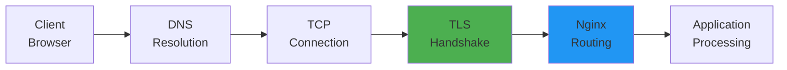
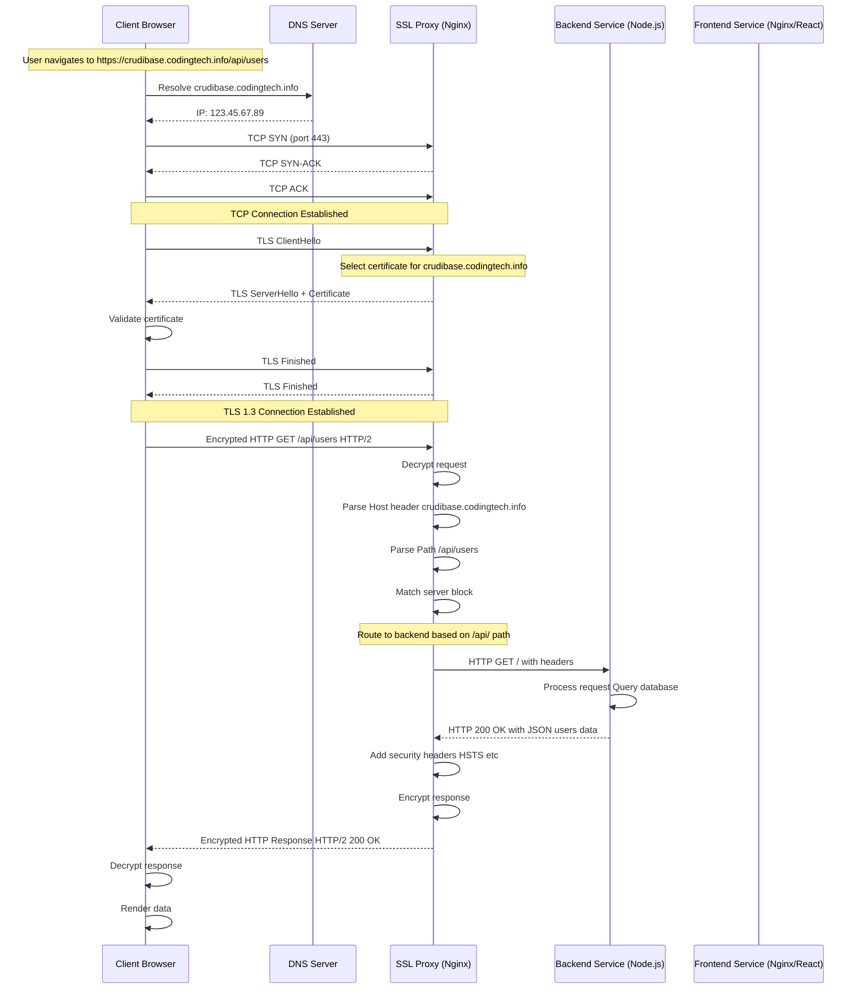
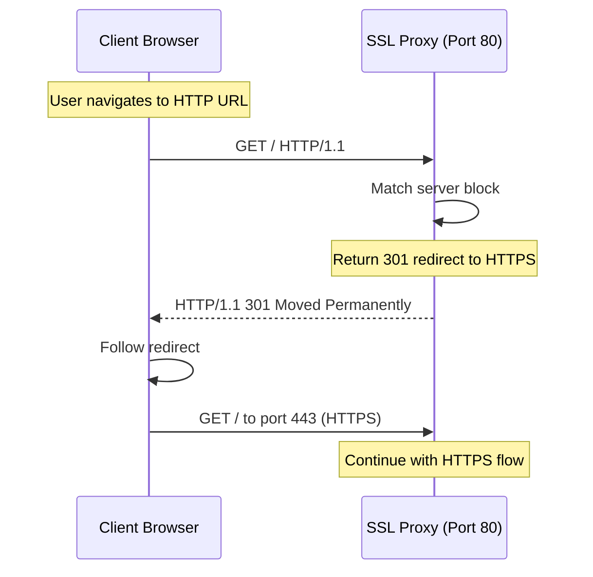
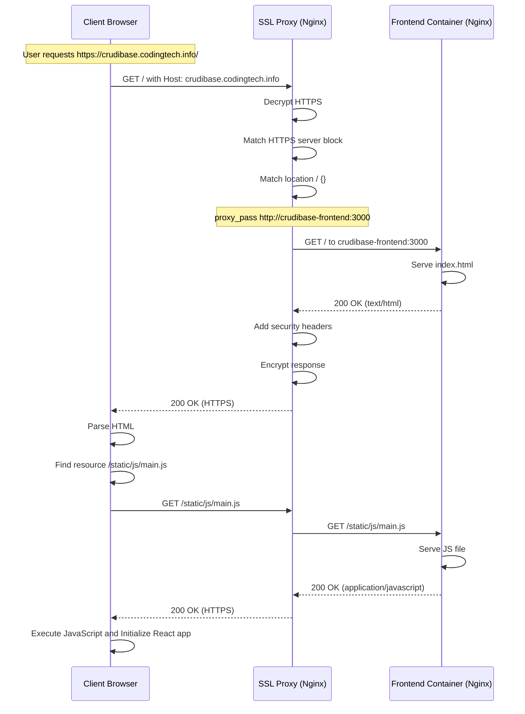
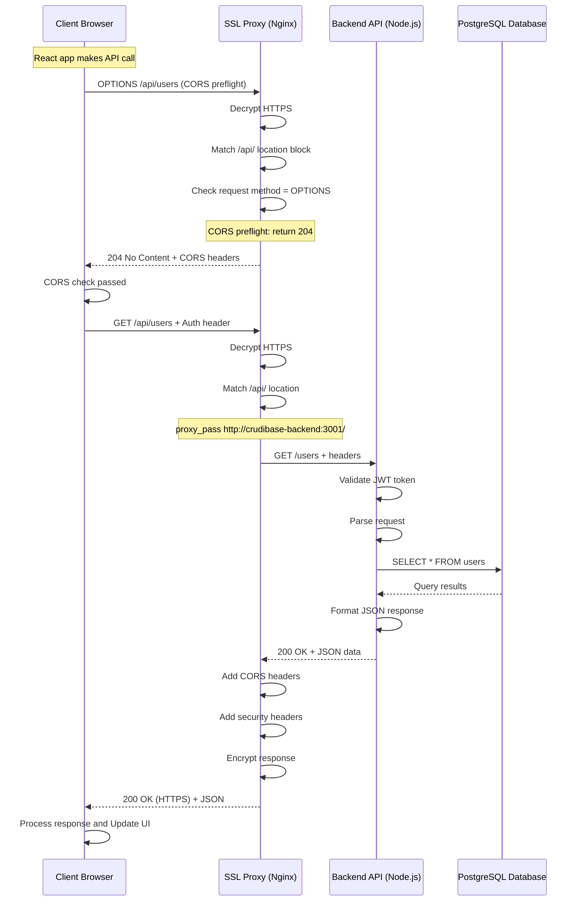
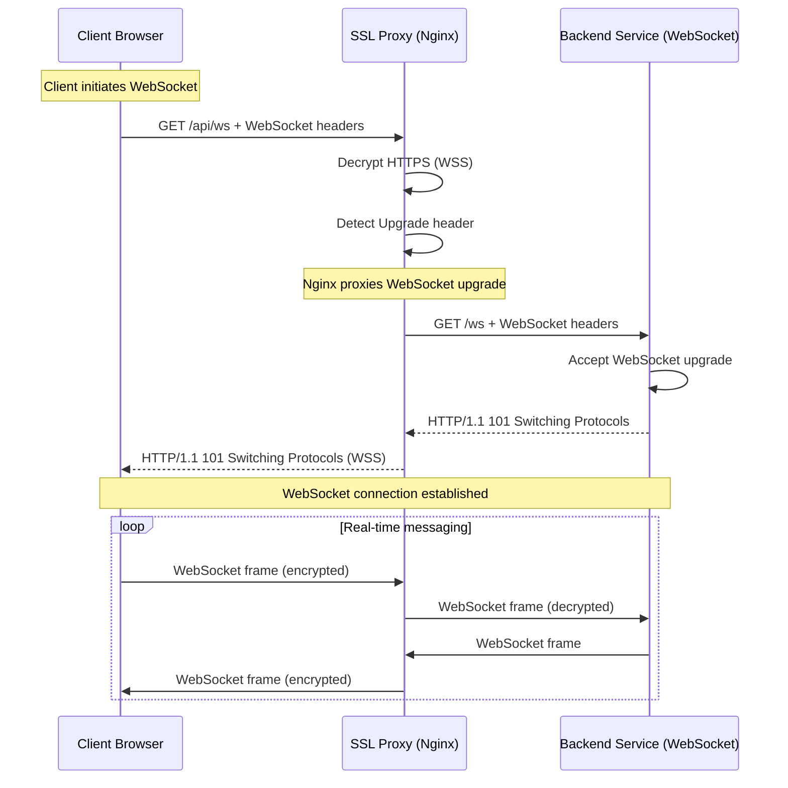
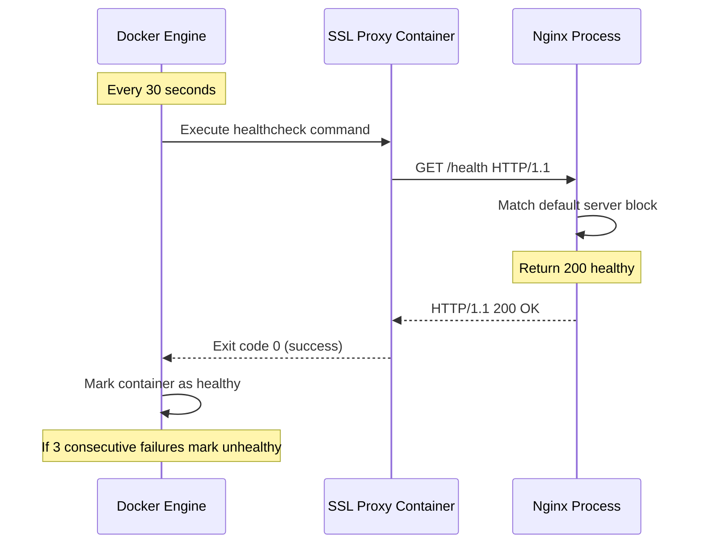
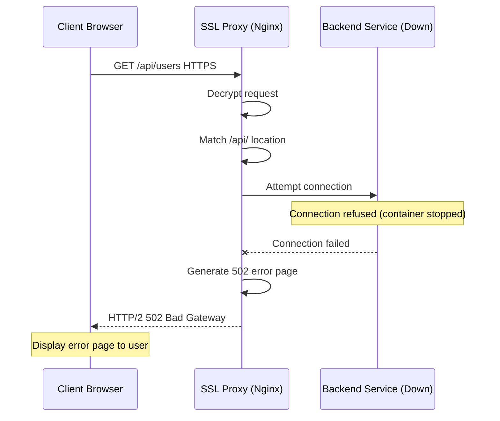
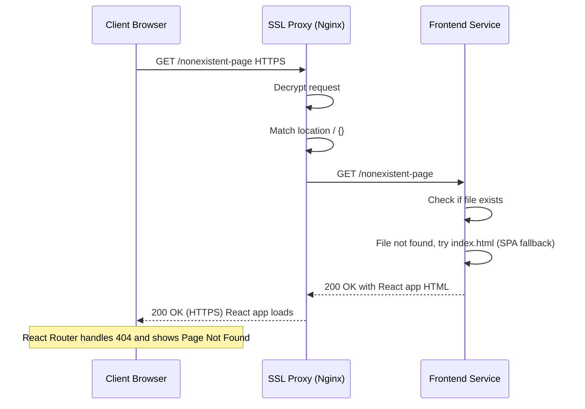
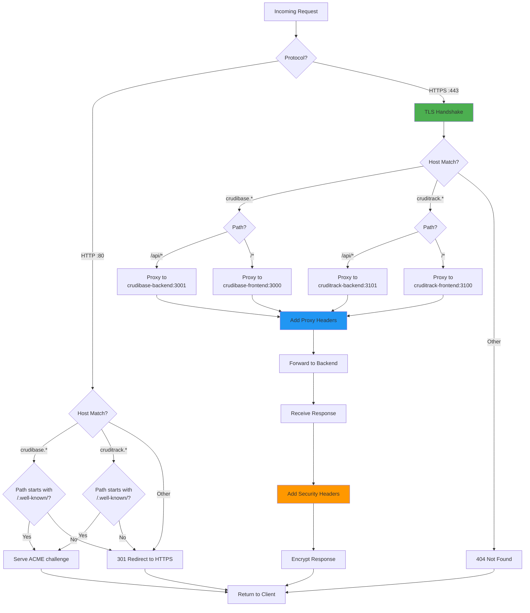

# Request Flow Documentation

This document details how HTTP and HTTPS requests flow through the SSL Proxy system, from the initial client request to the final application response.

## Table of Contents

- [Overview](#overview)
- [HTTPS Request Flow](#https-request-flow)
- [HTTP to HTTPS Redirect](#http-to-https-redirect)
- [Frontend Request Flow](#frontend-request-flow)
- [API Request Flow](#api-request-flow)
- [WebSocket Connection Flow](#websocket-connection-flow)
- [Health Check Flow](#health-check-flow)
- [Error Response Flow](#error-response-flow)

## Overview

The SSL Proxy acts as a reverse proxy, handling SSL/TLS termination and routing requests to appropriate backend services based on:
- **Host header** (subdomain routing)
- **Path** (frontend vs. API routing)
- **Protocol** (HTTP → HTTPS redirects)

### Request Flow Layers



## HTTPS Request Flow

### Complete HTTPS Request Sequence



### Request Headers Added by Nginx

When Nginx forwards requests to backend services, it adds several headers:

```nginx
proxy_set_header Host $host;                          # crudibase.codingtech.info
proxy_set_header X-Real-IP $remote_addr;              # Client's actual IP
proxy_set_header X-Forwarded-For $proxy_add_x_forwarded_for;  # Proxy chain
proxy_set_header X-Forwarded-Proto $scheme;           # https
proxy_set_header X-Forwarded-Host $host;              # crudibase.codingtech.info
proxy_set_header X-Forwarded-Port $server_port;       # 443
```

**Example Request to Backend**:
```http
GET /users HTTP/1.1
Host: crudibase-backend:3001
X-Real-IP: 203.0.113.42
X-Forwarded-For: 203.0.113.42
X-Forwarded-Proto: https
X-Forwarded-Host: crudibase.codingtech.info
X-Forwarded-Port: 443
User-Agent: Mozilla/5.0...
```

### Response Headers Added by Nginx

Nginx adds security headers to all responses:

```nginx
# Security headers (in nginx.conf)
add_header X-Frame-Options "SAMEORIGIN" always;
add_header X-Content-Type-Options "nosniff" always;
add_header X-XSS-Protection "1; mode=block" always;

# HSTS header (in crudibase.conf.template)
add_header Strict-Transport-Security "max-age=31536000; includeSubDomains" always;
```

**Example Response to Client**:
```http
HTTP/2 200 OK
Content-Type: application/json
Strict-Transport-Security: max-age=31536000; includeSubDomains
X-Frame-Options: SAMEORIGIN
X-Content-Type-Options: nosniff
X-XSS-Protection: 1; mode=block

{"users": [...]}
```

## HTTP to HTTPS Redirect

### HTTP Redirect Flow



### HTTP Redirect Configuration

```nginx
# crudibase.conf.template - HTTP server block
server {
    listen 80;
    server_name crudibase.${DOMAIN};

    # Let's Encrypt challenge (must be accessible via HTTP)
    location /.well-known/acme-challenge/ {
        root /var/www/certbot;
    }

    # Redirect all other traffic to HTTPS
    location / {
        return 301 https://$host$request_uri;
    }
}
```

**Redirect Behavior**:
- `http://crudibase.codingtech.info` → `https://crudibase.codingtech.info/`
- `http://crudibase.codingtech.info/api/users` → `https://crudibase.codingtech.info/api/users`
- `http://crudibase.codingtech.info/login?next=/dashboard` → `https://crudibase.codingtech.info/login?next=/dashboard`

## Frontend Request Flow

### Static Asset Request



### Frontend Nginx Configuration

Inside the frontend container (`crudibase-frontend`), there's typically an Nginx configuration like:

```nginx
server {
    listen 3000;
    server_name _;
    root /usr/share/nginx/html;
    index index.html;

    location / {
        try_files $uri $uri/ /index.html;  # SPA fallback
    }

    location /static/ {
        expires 1y;
        add_header Cache-Control "public, immutable";
    }
}
```

## API Request Flow

### API Request with CORS



### API Path Rewriting

The `/api/` prefix is stripped when forwarding to the backend:

**Nginx Configuration**:
```nginx
location /api/ {
    proxy_pass http://${CRUDIBASE_BACKEND_HOST}:${CRUDIBASE_BACKEND_PORT}/;
    # Note the trailing slash ──────────────────────────────────────────^
}
```

**Path Transformation**:
| Client Request | Nginx Receives | Backend Receives |
|----------------|----------------|------------------|
| `GET /api/users` | `/api/users` | `GET /users` |
| `POST /api/users/create` | `/api/users/create` | `POST /users/create` |
| `GET /api/auth/login` | `/api/auth/login` | `GET /auth/login` |

### CORS Configuration

```nginx
# In crudibase.conf.template - /api/ location block
location /api/ {
    # ... proxy settings ...

    # CORS headers
    add_header Access-Control-Allow-Origin "https://crudibase.${DOMAIN}" always;
    add_header Access-Control-Allow-Methods "GET, POST, PUT, DELETE, OPTIONS" always;
    add_header Access-Control-Allow-Headers "Authorization, Content-Type" always;
    add_header Access-Control-Allow-Credentials "true" always;

    # Handle preflight requests
    if ($request_method = 'OPTIONS') {
        return 204;
    }
}
```

## WebSocket Connection Flow

### WebSocket Upgrade Sequence



### WebSocket Nginx Configuration

```nginx
location /api/ {
    proxy_pass http://${CRUDIBASE_BACKEND_HOST}:${CRUDIBASE_BACKEND_PORT}/;
    proxy_http_version 1.1;

    # WebSocket support
    proxy_set_header Upgrade $http_upgrade;
    proxy_set_header Connection 'upgrade';
    proxy_cache_bypass $http_upgrade;

    # Standard proxy headers
    proxy_set_header Host $host;
    proxy_set_header X-Real-IP $remote_addr;
    proxy_set_header X-Forwarded-For $proxy_add_x_forwarded_for;
    proxy_set_header X-Forwarded-Proto $scheme;
}
```

## Health Check Flow

### Health Check Sequence



### Health Check Configuration

**Dockerfile**:
```dockerfile
HEALTHCHECK --interval=30s --timeout=3s --start-period=5s --retries=3 \
    CMD curl -f http://localhost/health || exit 1
```

**Nginx Configuration**:
```nginx
# default.conf.template
server {
    listen 80;
    server_name _;

    location /health {
        access_log off;
        return 200 "healthy\n";
        add_header Content-Type text/plain;
    }

    # ... other locations ...
}
```

**Testing**:
```bash
# Manual health check
curl http://YOUR_DROPLET_IP/health
# Response: healthy

# Check Docker health status
docker ps
# CONTAINER ID   STATUS
# abc123         Up 5 mins (healthy)
```

## Error Response Flow

### 502 Bad Gateway (Backend Down)



### 404 Not Found



### Common HTTP Status Codes

| Status Code | Scenario | Cause |
|-------------|----------|-------|
| **200 OK** | Successful request | Normal operation |
| **204 No Content** | CORS preflight | OPTIONS request handled by Nginx |
| **301 Moved Permanently** | HTTP → HTTPS redirect | Request to port 80 |
| **400 Bad Request** | Invalid request | Malformed headers, bad syntax |
| **401 Unauthorized** | Authentication failed | Invalid/missing JWT token (from backend) |
| **403 Forbidden** | Access denied | Backend authorization failed |
| **404 Not Found** | Resource not found | Backend returns 404 |
| **500 Internal Server Error** | Backend error | Application crash, unhandled exception |
| **502 Bad Gateway** | Backend unreachable | Container stopped, network issue |
| **503 Service Unavailable** | Backend overloaded | Too many connections |
| **504 Gateway Timeout** | Backend timeout | Backend taking too long (default: 60s) |

## Request Processing Summary

### Decision Tree



## Performance Considerations

### Connection Pooling

Nginx maintains connection pools to backend services:
- Reduces TCP handshake overhead
- Reuses connections for multiple requests
- Configurable keepalive settings

```nginx
upstream backend {
    server crudibase-backend:3001;
    keepalive 32;  # Number of idle connections to keep
}

location /api/ {
    proxy_pass http://backend/;
    proxy_http_version 1.1;
    proxy_set_header Connection "";  # Enable keepalive
}
```

### Caching (Optional)

To enable response caching:

```nginx
# Add to nginx.conf
proxy_cache_path /var/cache/nginx levels=1:2 keys_zone=api_cache:10m max_size=1g;

# Add to location block
location /api/ {
    proxy_cache api_cache;
    proxy_cache_valid 200 5m;  # Cache successful responses for 5 minutes
    proxy_cache_bypass $http_cache_control;
    add_header X-Cache-Status $upstream_cache_status;
}
```

## Related Documentation

- **[Architecture](Architecture.md)** - System architecture overview
- **[SSL Certificate Management](SSL-Certificate-Management.md)** - TLS handshake details
- **[Network Architecture](Network-Architecture.md)** - Docker networking configuration
- **[Components](Components.md)** - Nginx component details
- **[Troubleshooting](Troubleshooting.md)** - Debugging request issues

---

**Last Updated**: 2025-11-18
