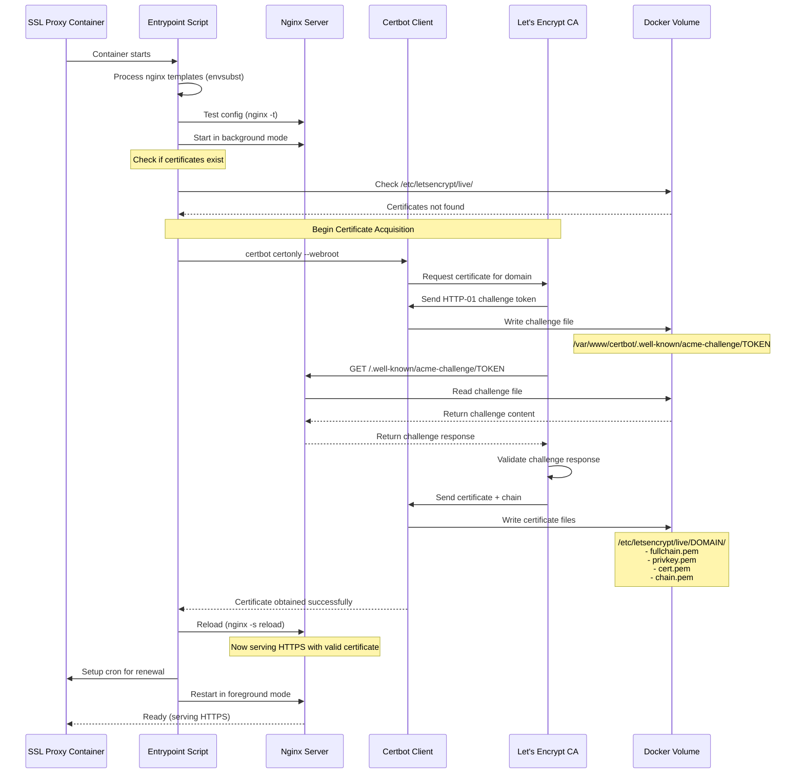
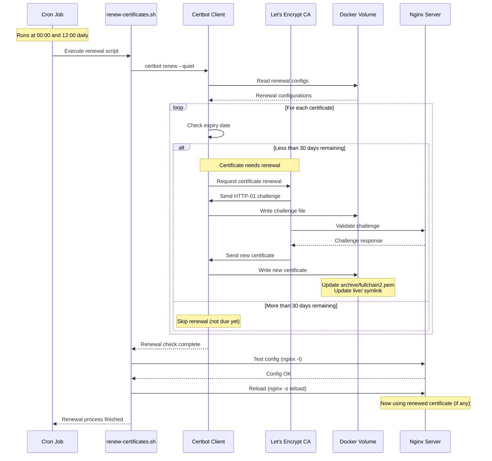
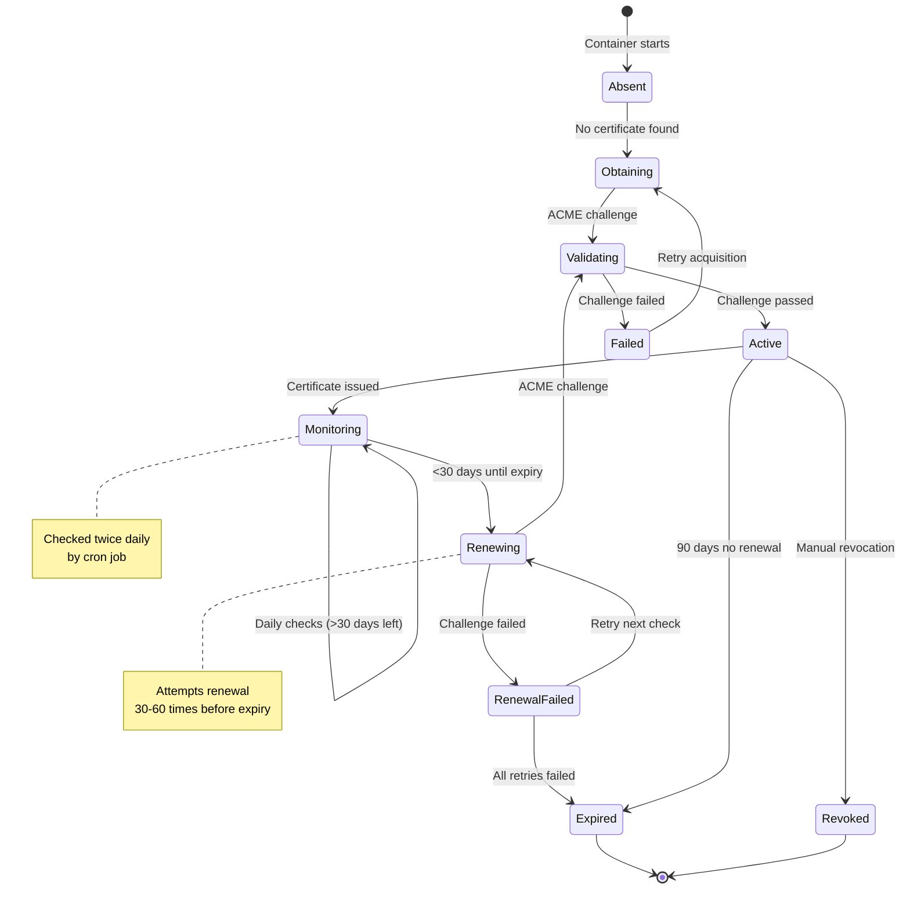
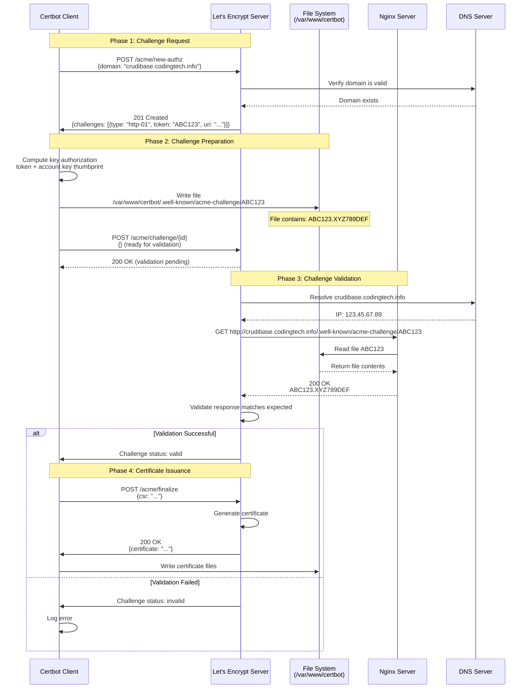

# SSL Certificate Management

This document provides comprehensive documentation of SSL/TLS certificate management in the SSL Proxy, including acquisition, renewal, storage, and troubleshooting.

## Table of Contents

- [Overview](#overview)
- [Certificate Acquisition](#certificate-acquisition)
- [Certificate Renewal](#certificate-renewal)
- [Certificate Storage](#certificate-storage)
- [Certificate Lifecycle](#certificate-lifecycle)
- [ACME Protocol Flow](#acme-protocol-flow)
- [Staging vs Production](#staging-vs-production)
- [Troubleshooting](#troubleshooting)

## Overview

The SSL Proxy uses **Let's Encrypt** (a free, automated Certificate Authority) to obtain and manage SSL/TLS certificates. Certificate management is handled by **Certbot**, the official Let's Encrypt client.

### Key Features

- **Automatic Acquisition**: Certificates obtained on first container start
- **Automatic Renewal**: Certificates renewed 30 days before expiry
- **Zero Downtime**: Nginx gracefully reloads when certificates update
- **Multi-Domain**: Separate certificates for each subdomain
- **Staging Mode**: Test certificate issuance without rate limits
- **Persistent Storage**: Certificates survive container restarts

### Certificate Details

| Property | Value |
|----------|-------|
| **Certificate Authority** | Let's Encrypt (ISRG Root X1) |
| **Certificate Type** | Domain Validation (DV) |
| **Key Algorithm** | RSA 2048-bit (default) |
| **Signature Algorithm** | SHA-256 with RSA |
| **Validity Period** | 90 days |
| **Renewal Window** | 30 days before expiry |
| **Challenge Type** | HTTP-01 (webroot) |

## Certificate Acquisition

### First-Time Certificate Acquisition Flow



### Certificate Acquisition Process

#### Step 1: Container Initialization

When the container starts, the entrypoint script (`/entrypoint.sh`) performs initialization:

```bash
#!/bin/bash
set -e

echo "=== SSL Proxy Entrypoint ==="

# Load environment variables
DOMAIN=${DOMAIN:-codingtech.info}
EMAIL=${EMAIL:-admin@${DOMAIN}}
STAGING=${STAGING:-false}
```

#### Step 2: Template Processing

Nginx configuration templates are processed with environment variables:

```bash
# Process nginx templates
for template in /etc/nginx/templates/*.template; do
    filename=$(basename "$template" .template)
    output="/etc/nginx/conf.d/$filename"
    envsubst '${DOMAIN} ${CRUDIBASE_BACKEND_HOST} ...' < "$template" > "$output"
done
```

#### Step 3: Certificate Check

The script checks if certificates already exist:

```bash
obtain_certificate() {
    local subdomain=$1
    local full_domain="${subdomain}.${DOMAIN}"

    if [ -f "/etc/letsencrypt/live/${full_domain}/fullchain.pem" ]; then
        echo "  Certificate already exists for $full_domain"
        return 0
    fi

    # Proceed with acquisition...
}
```

#### Step 4: Certbot Execution

If certificates don't exist, Certbot is invoked:

```bash
certbot certonly \
    --webroot \
    --webroot-path=/var/www/certbot \
    --email $EMAIL \
    --agree-tos \
    --no-eff-email \
    -d $full_domain
```

**Parameters Explained**:
- `certonly`: Obtain certificate without installing
- `--webroot`: Use webroot plugin (HTTP-01 challenge)
- `--webroot-path`: Directory for challenge files
- `--email`: Contact email for urgent renewal notices
- `--agree-tos`: Agree to Let's Encrypt Terms of Service
- `--no-eff-email`: Don't share email with EFF
- `-d`: Domain name(s) to obtain certificate for

#### Step 5: Challenge Validation

Let's Encrypt validates domain ownership via HTTP-01 challenge:

1. **Let's Encrypt** sends random token to Certbot
2. **Certbot** writes token to `/var/www/certbot/.well-known/acme-challenge/TOKEN`
3. **Let's Encrypt** makes HTTP request to `http://domain/.well-known/acme-challenge/TOKEN`
4. **Nginx** serves the challenge file
5. **Let's Encrypt** validates the response matches expected token

#### Step 6: Certificate Issuance

Upon successful validation:

1. Let's Encrypt generates certificate
2. Certbot receives certificate + intermediate chain
3. Files written to `/etc/letsencrypt/live/DOMAIN/`:
   - `fullchain.pem` - Certificate + intermediate chain (used by Nginx)
   - `privkey.pem` - Private key (used by Nginx)
   - `cert.pem` - Certificate only
   - `chain.pem` - Intermediate certificate chain only

#### Step 7: Nginx Reload

Nginx reloads to use the new certificates:

```bash
nginx -s reload
```

This performs a graceful reload:
- Master process spawns new workers with new config
- Old workers finish serving existing requests
- Old workers shut down
- Zero dropped connections

### Certificate File Structure

```
/etc/letsencrypt/
├── live/
│   ├── crudibase.codingtech.info/
│   │   ├── fullchain.pem  → ../../archive/crudibase.../fullchain1.pem
│   │   ├── privkey.pem    → ../../archive/crudibase.../privkey1.pem
│   │   ├── cert.pem       → ../../archive/crudibase.../cert1.pem
│   │   └── chain.pem      → ../../archive/crudibase.../chain1.pem
│   └── cruditrack.codingtech.info/
│       └── (same structure)
│
├── archive/
│   ├── crudibase.codingtech.info/
│   │   ├── fullchain1.pem  (version 1)
│   │   ├── fullchain2.pem  (version 2, after renewal)
│   │   ├── privkey1.pem
│   │   ├── privkey2.pem
│   │   └── ...
│   └── cruditrack.codingtech.info/
│       └── (same structure)
│
└── renewal/
    ├── crudibase.codingtech.info.conf
    └── cruditrack.codingtech.info.conf
```

**Directory Structure Explained**:
- **`live/`**: Symlinks to current active certificates (always use these in Nginx)
- **`archive/`**: Historical versions of certificates
- **`renewal/`**: Certbot renewal configuration files

## Certificate Renewal

### Automatic Renewal Flow



### Renewal Script

The renewal script (`/usr/local/bin/renew-certificates.sh`) runs twice daily:

```bash
#!/bin/bash
set -e

echo "[$(date)] Starting certificate renewal check..."

# Attempt to renew certificates
if certbot renew --quiet --webroot --webroot-path=/var/www/certbot; then
    echo "[$(date)] Certificate renewal check completed successfully"

    # Reload nginx if any certificates were renewed
    if nginx -t 2>/dev/null; then
        nginx -s reload
        echo "[$(date)] Nginx reloaded"
    fi
else
    echo "[$(date)] Certificate renewal check failed"
    exit 1
fi

echo "[$(date)] Certificate renewal process finished"
```

### Cron Schedule

Cron job is configured during container startup:

```bash
# Setup certificate renewal cron job (runs twice daily)
echo "0 0,12 * * * /usr/local/bin/renew-certificates.sh >> /var/log/letsencrypt/renew.log 2>&1" > /etc/crontabs/root
crond
```

**Schedule**: `0 0,12 * * *`
- **Minute**: 0 (at the top of the hour)
- **Hour**: 0, 12 (midnight and noon)
- **Day**: * (every day)
- **Month**: * (every month)
- **Weekday**: * (every day of week)

### Renewal Timeline

```mermaid
gantt
    title Certificate Lifecycle Timeline
    dateFormat X
    axisFormat Day %j

    section Certificate Validity
    Certificate Valid (90 days)           :valid, 0, 90d
    Renewal Window (last 30 days)         :crit, renewal, 60, 30d
    Certificate Expired                   :done, 90, 1d

    section Certbot Actions
    First Check (Day 60)                  :milestone, check1, 60, 0d
    Renewal Attempt (Day 60-90)           :active, renew_attempt, 60, 30d
    Daily Checks (2x per day)             :active, daily_checks, 60, 30d

    section Safety Margin
    Comfortable Zone (Day 0-60)           :safe, 0, 60d
    Warning Zone (Day 60-75)              :active, warn1, 60, 15d
    Critical Zone (Day 75-90)             :crit, crit1, 75, 15d
```



**Timeline Explained**:
- **Day 0**: Certificate issued, valid for 90 days
- **Day 1-59**: Certificate valid, no renewal needed
- **Day 60**: Certbot begins attempting renewal (30 days before expiry)
- **Day 60-89**: Renewal window (2 checks per day = up to 60 attempts)
- **Day 90**: Certificate expires (if renewal failed)

### Manual Renewal

To manually trigger certificate renewal:

```bash
# Exec into container
docker exec -it ssl-proxy bash

# Run renewal script manually
/usr/local/bin/renew-certificates.sh

# Or use certbot directly
certbot renew --force-renewal
```

## Certificate Lifecycle

### State Diagram



### Certificate States

| State | Description | Duration | Actions |
|-------|-------------|----------|---------|
| **Absent** | No certificate exists | Initial state | Trigger acquisition |
| **Obtaining** | Certbot requesting certificate | 30-60 seconds | Wait for validation |
| **Validating** | Let's Encrypt validating domain | 10-30 seconds | Serve ACME challenge |
| **Failed** | Acquisition failed | Until retry | Check logs, fix DNS/firewall |
| **Active** | Certificate valid and in use | 0-90 days | Monitor expiry |
| **Monitoring** | Active, >30 days until expiry | 0-60 days | Periodic checks |
| **Renewing** | Active, renewal in progress | 30 days before expiry | Attempt renewal daily |
| **Renewal Failed** | Renewal attempt failed | Until next retry | Check logs |
| **Expired** | Certificate past validity | N/A | Obtain new certificate |
| **Revoked** | Certificate revoked | N/A | Obtain new certificate |

## ACME Protocol Flow

### HTTP-01 Challenge Detailed Flow



### ACME Protocol Endpoints

| Endpoint | Method | Purpose |
|----------|--------|---------|
| `/acme/new-acct` | POST | Create new account |
| `/acme/new-authz` | POST | Request authorization for domain |
| `/acme/new-order` | POST | Create new certificate order |
| `/acme/challenge/{id}` | POST | Respond to challenge |
| `/acme/finalize` | POST | Submit CSR, get certificate |
| `/acme/cert/{id}` | GET | Download certificate |

### Challenge Response Format

**Challenge File Location**:
```
/var/www/certbot/.well-known/acme-challenge/{TOKEN}
```

**Challenge File Content**:
```
{TOKEN}.{ACCOUNT_KEY_THUMBPRINT}
```

**Example**:
```
# File: /var/www/certbot/.well-known/acme-challenge/LoqXcYV8q5ONbJQxbmR7SCTNo3tiAXDfowyjxAjEuX0
# Content: LoqXcYV8q5ONbJQxbmR7SCTNo3tiAXDfowyjxAjEuX0.9jg46WB3rR_AHD-EBXdN7cBkH1WOu0tA3M9fm21mqTI
```

**Nginx Configuration for ACME**:
```nginx
location /.well-known/acme-challenge/ {
    root /var/www/certbot;
}
```

## Staging vs Production

### Let's Encrypt Environments

Let's Encrypt provides two environments:

| Environment | Purpose | Rate Limits | Trusted by Browsers |
|-------------|---------|-------------|---------------------|
| **Production** | Real certificates | 50 certs/domain/week | ✅ Yes |
| **Staging** | Testing | Much higher limits | ❌ No |

### Using Staging Mode

Enable staging mode via environment variable:

```yaml
# docker-compose.yml
environment:
  - STAGING=true
```

**Staging Server**: `https://acme-staging-v02.api.letsencrypt.org/directory`
**Production Server**: `https://acme-v02.api.letsencrypt.org/directory`

### When to Use Staging

✅ **Use Staging When**:
- Testing new domain configurations
- Debugging certificate acquisition issues
- Developing new features
- Learning the deployment process
- Validating DNS configuration

❌ **Don't Use Staging When**:
- Deploying to production
- Serving real user traffic
- Need browser-trusted certificates

### Switching from Staging to Production

```bash
# 1. Stop container
docker compose down

# 2. Remove staging certificates
docker volume rm ssl-proxy_letsencrypt

# 3. Update environment
# Set STAGING=false in docker-compose.yml

# 4. Restart container
docker compose up -d

# 5. Verify production certificates
docker exec ssl-proxy certbot certificates
```

## Certificate Storage

### Docker Volume Structure

```
Docker Host
└── /var/lib/docker/volumes/
    ├── ssl-proxy_letsencrypt/
    │   └── _data/
    │       └── /etc/letsencrypt/  (mounted in container)
    │           ├── live/
    │           ├── archive/
    │           ├── renewal/
    │           ├── accounts/
    │           └── renewal-hooks/
    │
    └── ssl-proxy_certbot-www/
        └── _data/
            └── /var/www/certbot/  (mounted in container)
                └── .well-known/
                    └── acme-challenge/
```

### Volume Configuration

```yaml
# docker-compose.yml
volumes:
  letsencrypt:
    driver: local
  certbot-www:
    driver: local

services:
  ssl-proxy:
    volumes:
      - letsencrypt:/etc/letsencrypt
      - certbot-www:/var/www/certbot
```

### Backup and Restore

#### Backup Certificates

```bash
# Create timestamped backup
docker run --rm \
  -v ssl-proxy_letsencrypt:/data \
  -v $(pwd):/backup \
  alpine tar czf /backup/ssl-certs-$(date +%Y%m%d).tar.gz -C /data .
```

#### Restore Certificates

```bash
# Restore from backup
docker run --rm \
  -v ssl-proxy_letsencrypt:/data \
  -v $(pwd):/backup \
  alpine sh -c "cd /data && tar xzf /backup/ssl-certs-20251118.tar.gz"
```

#### Verify Backup

```bash
# List backup contents
tar -tzf ssl-certs-20251118.tar.gz | head -20
```

## Troubleshooting

### Common Issues

#### 1. Certificate Acquisition Failed

**Symptoms**:
```
Failed to obtain certificate for crudibase.codingtech.info
```

**Possible Causes**:
- DNS not resolving correctly
- Port 80 blocked by firewall
- Domain not pointing to droplet IP
- Rate limit exceeded

**Solutions**:

```bash
# Check DNS resolution
dig crudibase.codingtech.info +short
# Should return: YOUR_DROPLET_IP

# Test port 80 accessibility
curl -I http://crudibase.codingtech.info/.well-known/acme-challenge/test

# Use staging mode for testing
# Set STAGING=true in docker-compose.yml

# Check certbot logs
docker exec ssl-proxy cat /var/log/letsencrypt/letsencrypt.log
```

#### 2. Certificate Renewal Failed

**Symptoms**:
```
[2025-11-18] Certificate renewal check failed
```

**Possible Causes**:
- Nginx configuration error
- Port 80 blocked
- Challenge files not accessible
- Network connectivity issues

**Solutions**:

```bash
# Check renewal logs
docker exec ssl-proxy cat /var/log/letsencrypt/renew.log

# Manual renewal test
docker exec ssl-proxy certbot renew --dry-run

# Check nginx config
docker exec ssl-proxy nginx -t

# Test challenge endpoint
curl http://crudibase.codingtech.info/.well-known/acme-challenge/
```

#### 3. Mixed Content Warnings

**Symptoms**:
Browser shows "Not Secure" or mixed content warnings

**Possible Causes**:
- HTTP resources loaded on HTTPS page
- Incorrect proxy headers
- Application not using HTTPS URLs

**Solutions**:

```nginx
# Ensure proxy headers are set (in nginx config)
proxy_set_header X-Forwarded-Proto $scheme;
proxy_set_header X-Forwarded-Host $host;

# Application should check X-Forwarded-Proto header
# and generate HTTPS URLs accordingly
```

#### 4. Certificate Shows as Invalid

**Symptoms**:
Browser shows "Certificate not trusted"

**Possible Causes**:
- Using staging certificates in production
- Certificate expired
- Certificate for wrong domain

**Solutions**:

```bash
# Check which certificates are installed
docker exec ssl-proxy certbot certificates

# Verify certificate details
echo | openssl s_client -connect crudibase.codingtech.info:443 -servername crudibase.codingtech.info 2>/dev/null | openssl x509 -noout -text

# If using staging, switch to production:
# 1. Set STAGING=false
# 2. Remove volume: docker volume rm ssl-proxy_letsencrypt
# 3. Restart container
```

### Diagnostic Commands

```bash
# View all certificates
docker exec ssl-proxy certbot certificates

# Check certificate expiry
docker exec ssl-proxy certbot certificates

# View renewal configuration
docker exec ssl-proxy cat /etc/letsencrypt/renewal/crudibase.codingtech.info.conf

# Test renewal (dry run)
docker exec ssl-proxy certbot renew --dry-run

# View Certbot logs
docker exec ssl-proxy tail -f /var/log/letsencrypt/letsencrypt.log

# View renewal logs
docker exec ssl-proxy tail -f /var/log/letsencrypt/renew.log

# Check nginx SSL configuration
docker exec ssl-proxy nginx -T | grep ssl

# Test SSL connection
openssl s_client -connect crudibase.codingtech.info:443 -servername crudibase.codingtech.info
```

## Related Documentation

- **[Architecture](Architecture.md)** - System architecture overview
- **[Components](Components.md)** - Nginx and Certbot component details
- **[Request Flow](Request-Flow.md)** - How HTTPS requests are processed
- **[Troubleshooting](Troubleshooting.md)** - General troubleshooting guide

---

**Last Updated**: 2025-11-18
