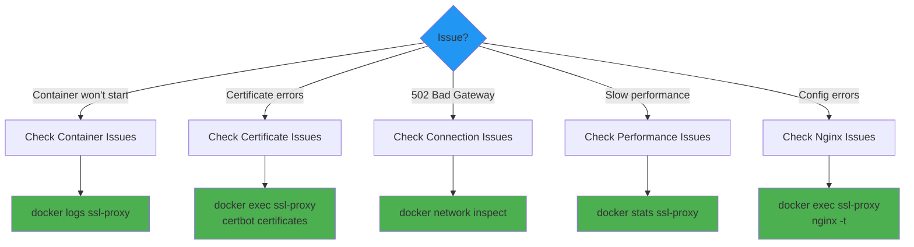

# Troubleshooting Guide

This document provides solutions to common issues encountered when deploying and operating the SSL Proxy.

## Table of Contents

- [Quick Diagnostics](#quick-diagnostics)
- [Certificate Issues](#certificate-issues)
- [Connection Issues](#connection-issues)
- [Container Issues](#container-issues)
- [Performance Issues](#performance-issues)
- [Nginx Issues](#nginx-issues)
- [Network Issues](#network-issues)

## Quick Diagnostics

### Health Check Commands

Run these commands to quickly assess system health:

```bash
# 1. Check container status
docker ps | grep ssl-proxy
# Should show: Up X minutes (healthy)

# 2. Check logs for errors
docker logs ssl-proxy --tail 50

# 3. Test nginx configuration
docker exec ssl-proxy nginx -t
# Should show: syntax is ok, test is successful

# 4. Check certificates
docker exec ssl-proxy certbot certificates

# 5. Test HTTPS endpoint
curl -I https://crudibase.codingtech.info
# Should return: HTTP/2 200

# 6. Test HTTP redirect
curl -I http://crudibase.codingtech.info
# Should return: HTTP/1.1 301 Moved Permanently

# 7. Check health endpoint
curl http://YOUR_DROPLET_IP/health
# Should return: healthy
```

### Diagnostic Decision Tree



## Certificate Issues

### Issue 1: Certificate Acquisition Failed

**Symptoms**:
```
Failed to obtain certificate for crudibase.codingtech.info
```

**Possible Causes**:
1. DNS not resolving correctly
2. Port 80 blocked by firewall
3. Domain not pointing to droplet IP
4. Let's Encrypt rate limit exceeded

**Solutions**:

#### Check DNS Resolution

```bash
# From your local machine
dig crudibase.codingtech.info +short
# Should return: YOUR_DROPLET_IP

# If not resolved, wait 5-10 minutes for DNS propagation
# Or check DNS configuration in DigitalOcean
```

#### Check Port 80 Accessibility

```bash
# From your local machine
curl -I http://crudibase.codingtech.info/.well-known/acme-challenge/test
# Should NOT return "Connection refused"

# If blocked, check firewall:
# - DigitalOcean Firewall: Allow TCP port 80
# - UFW: sudo ufw allow 80/tcp
```

#### Check Rate Limits

```bash
# View certbot logs
docker exec ssl-proxy cat /var/log/letsencrypt/letsencrypt.log | grep -i "rate limit"

# If rate limited, use staging mode temporarily:
# In docker-compose.prod.yml, set: STAGING=true
# Restart container, test, then switch back to false
```

#### Use Staging Mode for Testing

```yaml
# In docker-compose.prod.yml
environment:
  - STAGING=true  # Add this line

# Deploy
docker compose -f docker-compose.prod.yml up -d

# After successful test, remove staging mode
environment:
  - STAGING=false  # Or remove the line

# Restart to get production certificate
docker compose -f docker-compose.prod.yml down
docker volume rm ssl-proxy_letsencrypt  # Remove staging certs
docker compose -f docker-compose.prod.yml up -d
```

### Issue 2: Certificate Renewal Failed

**Symptoms**:
```
[2025-11-18 12:00:00] Certificate renewal check failed
```

**Diagnostic Steps**:

```bash
# 1. Check renewal logs
docker exec ssl-proxy cat /var/log/letsencrypt/renew.log

# 2. Test renewal manually (dry run)
docker exec ssl-proxy certbot renew --dry-run

# 3. Check nginx config
docker exec ssl-proxy nginx -t

# 4. Verify port 80 is accessible
curl http://crudibase.codingtech.info/.well-known/acme-challenge/
```

**Solutions**:

#### Fix Nginx Configuration

```bash
# Test config
docker exec ssl-proxy nginx -t

# If errors, check recent changes
docker exec ssl-proxy cat /etc/nginx/conf.d/crudibase.conf

# Reload nginx
docker exec ssl-proxy nginx -s reload
```

#### Manual Renewal

```bash
# Force renewal
docker exec ssl-proxy certbot renew --force-renewal

# Check certificate status
docker exec ssl-proxy certbot certificates
```

### Issue 3: Mixed Content Warnings

**Symptoms**:
Browser shows "Not Secure" or mixed content warnings despite HTTPS

**Cause**:
Application loading HTTP resources on HTTPS page

**Solution**:

```nginx
# Ensure proxy headers are set (in nginx template)
proxy_set_header X-Forwarded-Proto $scheme;
proxy_set_header X-Forwarded-Host $host;

# In your application, check X-Forwarded-Proto header
# Generate URLs as HTTPS when header is "https"
```

**Application Code Example** (Node.js):
```javascript
// In backend
app.use((req, res, next) => {
  if (req.headers['x-forwarded-proto'] === 'https') {
    req.protocol = 'https';
  }
  next();
});
```

### Issue 4: Certificate Shows as Invalid

**Symptoms**:
Browser shows "Certificate not trusted" or "Invalid certificate"

**Diagnostic**:

```bash
# Check which certificates are installed
docker exec ssl-proxy certbot certificates

# Check if using staging certificates
docker exec ssl-proxy certbot certificates | grep "staging"

# View certificate details
echo | openssl s_client -connect crudibase.codingtech.info:443 -servername crudibase.codingtech.info 2>/dev/null | openssl x509 -noout -text
```

**Solutions**:

#### If Using Staging Certificates

```bash
# Remove staging certificates
docker compose -f docker-compose.prod.yml down
docker volume rm ssl-proxy_letsencrypt

# Update to production mode
# In docker-compose.prod.yml, set: STAGING=false

# Restart
docker compose -f docker-compose.prod.yml up -d
```

#### If Certificate is for Wrong Domain

```bash
# Check environment variables
docker exec ssl-proxy env | grep DOMAIN

# Verify nginx config
docker exec ssl-proxy cat /etc/nginx/conf.d/crudibase.conf | grep server_name
```

## Connection Issues

### Issue 1: 502 Bad Gateway

**Symptoms**:
```
HTTP/1.1 502 Bad Gateway
```

**Cause**: Backend service not accessible

**Diagnostic**:

```bash
# 1. Check if backend containers are running
docker ps | grep crudibase

# 2. Test connectivity from ssl-proxy
docker exec ssl-proxy ping -c 1 crudibase-backend

# 3. Test HTTP connection
docker exec ssl-proxy curl -I http://crudibase-backend:3001/health

# 4. Check docker networks
docker network inspect crudibase-network
```

**Solutions**:

#### Backend Not Running

```bash
# Start backend services
cd /opt/crudibase
docker compose up -d

# Verify
docker ps | grep crudibase
```

#### Network Not Connected

```bash
# Check ssl-proxy network connections
docker inspect ssl-proxy --format '{{range $key, $value := .NetworkSettings.Networks}}{{$key}}{{"\n"}}{{end}}'

# Should show:
# crudibase-network
# cruditrack-network

# If missing, reconnect:
docker network connect crudibase-network ssl-proxy
docker compose -f docker-compose.prod.yml restart ssl-proxy
```

#### Wrong Backend Hostname

```bash
# Check environment variable
docker exec ssl-proxy env | grep CRUDIBASE_BACKEND_HOST

# Should match actual container name
docker ps --format '{{.Names}}' | grep backend

# If mismatch, update docker-compose.prod.yml and restart
```

### Issue 2: 504 Gateway Timeout

**Symptoms**:
```
HTTP/1.1 504 Gateway Timeout
```

**Cause**: Backend taking too long to respond

**Solution**:

```nginx
# Add timeout settings to location block (in template)
location /api/ {
    proxy_read_timeout 300s;  # 5 minutes
    proxy_connect_timeout 75s;
    proxy_send_timeout 300s;

    proxy_pass http://backend:3001/;
}
```

**Or** investigate why backend is slow:

```bash
# Check backend logs
docker logs crudibase-backend --tail 100

# Check backend resource usage
docker stats crudibase-backend --no-stream
```

### Issue 3: Connection Refused

**Symptoms**:
```
curl: (7) Failed to connect to crudibase.codingtech.info port 443: Connection refused
```

**Diagnostic**:

```bash
# 1. Check if ssl-proxy is running
docker ps | grep ssl-proxy

# 2. Check if ports are published
docker port ssl-proxy

# 3. Check firewall
sudo ufw status
```

**Solutions**:

#### Container Not Running

```bash
# Check logs for why it stopped
docker logs ssl-proxy

# Restart
docker compose -f docker-compose.prod.yml up -d
```

#### Ports Not Published

```bash
# Check docker-compose.prod.yml
cat docker-compose.prod.yml | grep -A 2 "ports:"

# Should show:
#   ports:
#     - "80:80"
#     - "443:443"
```

#### Firewall Blocking

```bash
# Check DigitalOcean firewall in web UI
# Or check UFW:
sudo ufw status

# Allow ports if needed:
sudo ufw allow 80/tcp
sudo ufw allow 443/tcp
```

## Container Issues

### Issue 1: Container Won't Start

**Symptoms**:
```
docker compose up -d
# Container exits immediately
```

**Diagnostic**:

```bash
# View logs
docker logs ssl-proxy

# Check for common errors:
# - "Network ... not found" -> Application containers not started
# - "Address already in use" -> Port 80/443 in use
# - "nginx: configuration test failed" -> Config syntax error
```

**Solutions**:

#### Network Not Found

```bash
# Start application containers first
cd /opt/crudibase
docker compose up -d

cd /opt/cruditrack
docker compose up -d

# Then start ssl-proxy
cd /opt/ssl-proxy
docker compose -f docker-compose.prod.yml up -d
```

#### Port Already in Use

```bash
# Find what's using the port
sudo lsof -i :443

# If it's an old ssl-proxy container:
docker stop ssl-proxy
docker rm ssl-proxy

# If it's another service:
sudo systemctl stop <service-name>
```

#### Config Test Failed

```bash
# View logs for specific error
docker logs ssl-proxy 2>&1 | grep "nginx:"

# Common issues:
# - Missing variable in template
# - Syntax error in nginx config
# - Missing certificate file
```

### Issue 2: Container Shows as Unhealthy

**Symptoms**:
```
docker ps
# STATUS: Up 5 minutes (unhealthy)
```

**Diagnostic**:

```bash
# Check health check
docker inspect ssl-proxy --format='{{json .State.Health}}' | jq

# Test health endpoint manually
docker exec ssl-proxy curl -f http://localhost/health
```

**Solution**:

```bash
# If nginx is not responding:
docker exec ssl-proxy ps aux | grep nginx

# If no nginx process, check logs:
docker logs ssl-proxy

# Restart container:
docker compose -f docker-compose.prod.yml restart ssl-proxy
```

### Issue 3: Container Restart Loop

**Symptoms**:
Container keeps restarting every few seconds

**Diagnostic**:

```bash
# View logs
docker logs ssl-proxy --tail 100

# Check restart count
docker inspect ssl-proxy --format='{{.RestartCount}}'
```

**Common Causes**:
1. Entrypoint script failing
2. Nginx configuration error
3. Certificate acquisition failing repeatedly

**Solution**:

```bash
# Temporarily disable restart to debug
docker update --restart=no ssl-proxy

# View full logs
docker logs ssl-proxy

# Fix the issue based on logs
# Then re-enable restart:
docker update --restart=unless-stopped ssl-proxy
docker compose -f docker-compose.prod.yml up -d
```

## Performance Issues

### Issue 1: Slow Response Times

**Diagnostic**:

```bash
# Check resource usage
docker stats ssl-proxy --no-stream

# Check worker connections
docker exec ssl-proxy ps aux | grep nginx | wc -l

# Check nginx access logs
docker exec ssl-proxy tail -f /var/log/nginx/access.log
```

**Solutions**:

#### Increase Worker Connections

```nginx
# In nginx.conf
events {
    worker_connections 4096;  # Increase from 1024
}
```

#### Enable Keepalive

```nginx
# In nginx.conf
keepalive_timeout 65;

# In location blocks
proxy_http_version 1.1;
proxy_set_header Connection "";
```

#### Enable Caching (Optional)

See [Configuration Guide](Configuration) for caching setup.

### Issue 2: High CPU Usage

**Diagnostic**:

```bash
# Check container stats
docker stats ssl-proxy

# Check nginx error log
docker exec ssl-proxy cat /var/log/nginx/error.log
```

**Common Causes**:
1. High traffic volume
2. No gzip compression
3. No SSL session caching
4. Slow backend responses

**Solutions**:

#### Enable Gzip (should already be enabled)

```nginx
# In nginx.conf
gzip on;
gzip_comp_level 6;
```

#### Enable SSL Session Caching (should already be enabled)

```nginx
# In server block
ssl_session_cache shared:SSL:10m;
ssl_session_timeout 10m;
```

### Issue 3: High Memory Usage

**Diagnostic**:

```bash
# Check memory usage
docker stats ssl-proxy --no-stream

# Check for memory leaks
docker exec ssl-proxy ps aux --sort=-rss | head -10
```

**Solution**:

Usually not an issue with Nginx. If memory is high:
1. Check if old worker processes aren't terminating
2. Reduce `worker_connections` if very high
3. Check for large log files: `docker exec ssl-proxy du -sh /var/log/nginx/`

## Nginx Issues

### Issue 1: Configuration Test Failed

**Symptoms**:
```
nginx: [emerg] unexpected "}" in /etc/nginx/conf.d/crudibase.conf:25
nginx: configuration file /etc/nginx/nginx.conf test failed
```

**Diagnostic**:

```bash
# Test config
docker exec ssl-proxy nginx -t

# View generated config
docker exec ssl-proxy cat /etc/nginx/conf.d/crudibase.conf
```

**Solutions**:

#### Syntax Error in Template

1. Check template file in repository
2. Fix syntax error
3. Rebuild and redeploy image

#### Missing Environment Variable

```bash
# Check if variable is set
docker exec ssl-proxy env | grep CRUDIBASE_BACKEND_HOST

# If missing, add to docker-compose.prod.yml
```

### Issue 2: Nginx Won't Reload

**Symptoms**:
```
nginx -s reload
# No effect, or error message
```

**Diagnostic**:

```bash
# Check if nginx is running
docker exec ssl-proxy ps aux | grep nginx

# Check for config errors
docker exec ssl-proxy nginx -t
```

**Solution**:

```bash
# If config is valid but reload doesn't work:
docker compose -f docker-compose.prod.yml restart ssl-proxy
```

## Network Issues

### Issue 1: Cannot Reach Backend

**Symptoms**:
```
docker exec ssl-proxy ping crudibase-backend
# ping: bad address 'crudibase-backend'
```

**Cause**: Container not connected to network

**Solution**:

```bash
# Check connected networks
docker inspect ssl-proxy --format '{{range $key, $ := .NetworkSettings.Networks}}{{$key}}{{"\n"}}{{end}}'

# Connect to network
docker network connect crudibase-network ssl-proxy

# Restart container
docker compose -f docker-compose.prod.yml restart ssl-proxy
```

### Issue 2: DNS Not Resolving

**Symptoms**:
External domain names don't resolve from inside container

**Diagnostic**:

```bash
# Test DNS resolution
docker exec ssl-proxy nslookup google.com

# Check DNS server
docker exec ssl-proxy cat /etc/resolv.conf
```

**Solution**:

Usually this is a Docker daemon issue:

```bash
# Restart Docker daemon
sudo systemctl restart docker

# Restart containers
docker compose -f docker-compose.prod.yml up -d
```

## Logging and Monitoring

### View Logs

```bash
# Container logs
docker logs ssl-proxy -f

# Nginx access log
docker exec ssl-proxy tail -f /var/log/nginx/access.log

# Nginx error log
docker exec ssl-proxy tail -f /var/log/nginx/error.log

# Certificate renewal log
docker exec ssl-proxy tail -f /var/log/letsencrypt/renew.log

# Certbot acquisition log
docker exec ssl-proxy cat /var/log/letsencrypt/letsencrypt.log
```

### Log Levels

Adjust nginx error log level in `nginx.conf`:

```nginx
error_log /var/log/nginx/error.log warn;
#                                    ^^^^
# Levels: debug, info, notice, warn, error, crit, alert, emerg
```

For debugging, use `debug`:
```nginx
error_log /var/log/nginx/error.log debug;
```

## Getting Help

If you still have issues after trying these solutions:

1. **Check logs**: `docker logs ssl-proxy --tail 100`
2. **Test configuration**: `docker exec ssl-proxy nginx -t`
3. **Check certificates**: `docker exec ssl-proxy certbot certificates`
4. **Review recent changes**: What changed before the issue started?
5. **Search existing issues**: Check GitHub issues in the repository

### Useful Information to Provide

When asking for help, include:

```bash
# 1. Container status
docker ps | grep ssl-proxy

# 2. Recent logs
docker logs ssl-proxy --tail 50

# 3. Nginx config test
docker exec ssl-proxy nginx -t

# 4. Environment (sanitized)
docker exec ssl-proxy env | grep -E "(DOMAIN|ENABLE_)"

# 5. Network configuration
docker network inspect crudibase-network --format '{{range .Containers}}{{.Name}}{{"\n"}}{{end}}'

# 6. Certificate status
docker exec ssl-proxy certbot certificates
```

## Related Documentation

- **[Components](Components)** - Component details for deeper debugging
- **[Configuration](Configuration)** - Configuration reference
- **[SSL Certificate Management](SSL-Certificate-Management)** - Certificate troubleshooting
- **[Network Architecture](Network-Architecture)** - Network debugging

---

**Last Updated**: 2025-11-18
